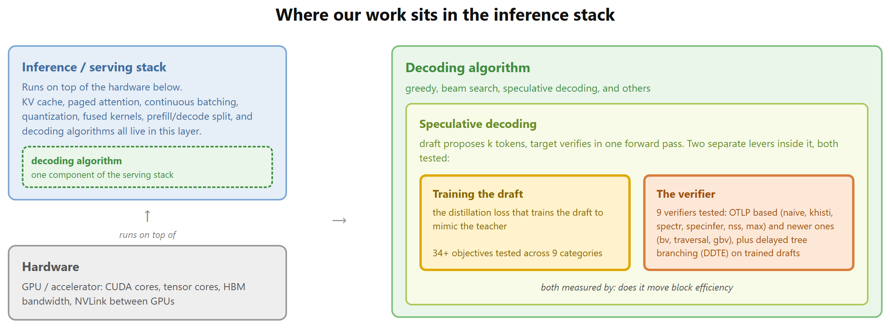
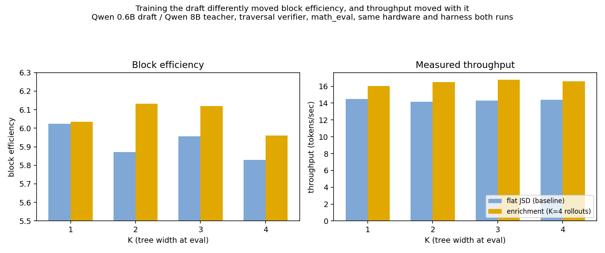

# Tokens per second measures the system. Block efficiency measures the algorithm.

In [Engineering an LLM inference research platform for speculative decoding](LINK_TO_POST_1), I wrote one line almost in passing: I optimized block efficiency, not tokens per second. Here is why I said that.

## Why inference speed is worth obsessing over

Training a large model is a one time bill. Inference is paid on every request, forever, and the volume is enormous. Products like ChatGPT are reported to handle on the order of a billion messages a day, and every message is many forward passes through a large model. For a deployed model, inference, not training, dominates lifetime cost.

At that scale small percentages turn into big money. Cut the cost per token by a few percent, times a billion requests a day, and you save millions of dollars a year. The same speedup also cuts latency, so the product feels fast instead of slow. Inference is where systems and ML meet, and both the money and the user experience depend on it.

## The problem: tokens per second measures three things at once

The obvious speed metric is tokens processed per second. The trouble is that it is a function of two independent things, and my own work is a narrow slice of the second one:

1. the underlying compute and memory hardware, [what it looks like](https://www.intoai.pub/p/what-every-ai-engineer-must-know-about-nvidia-gpus) and [how it actually behaves during inference](https://www.intoai.pub/p/a-hardware-level-tour-of-llm-inference),
2. [how optimized the inference serving stack is](https://www.intoai.pub/p/10-llm-inference-optimization-techniques): KV caching, quantization, continuous batching, and speculative decoding, which pairs a small draft model from the same family as the target, sharing its tokenizer and vocabulary, with the large target model, all sitting in that same list of techniques.

Speculative decoding was the one technique I worked inside of, and inside that, one narrow question: can a small draft model be trained to predict tokens as close as possible to what the big teacher would have predicted, and which loss function actually makes the draft the better learner.

Change any one of these and tokens per second moves. If I reported it, no one could tell whether a gain came from a better trained draft, from a smarter serving stack, or from the hardware I happened to grab that day. I needed a metric that holds the hardware and the rest of the serving stack fixed and isolates just the draft's training.

## What block efficiency is, by example

Normal decoding is autoregressive: each token is predicted conditioned on every token generated before it. In practice that means you generate one token, append it to the sequence, and run the whole model again to predict the next one, a full forward pass per token, every time. That per token pass is the expensive part.

Speculative decoding gets around paying that cost one token at a time. A small fast draft model guesses several tokens ahead. The large target model checks all of them in a single forward pass and keeps the longest prefix it agrees with. Block efficiency is accepted tokens per target forward pass, how many guesses you got confirmed for the price of one expensive pass.

Take the prompt "The capital of France is", and suppose the target would generate "Paris, which sits on the Seine". A good draft guesses "Paris, which sits on" and the target accepts all five tokens in one pass. A weaker draft guesses "Paris, a lovely old" and the target only accepts "Paris," before the guess diverges, confirming two tokens and generating the rest itself.

Here is the part that matters: the final text is identical either way, "Paris, which sits on the Seine", because the target's own distribution is what gets output regardless of the draft. The draft never changes the answer, only how many tokens get confirmed per target call. So block efficiency is purely a speed number. The weaker draft is not giving a worse answer, it is just forcing more target calls to produce the same one.

None of that depends on hardware or software. Run this on a slow naive loop on an A100, or on a fast batched stack like vLLM on a B200, and tokens per second will be very different. But the count of accepted tokens per target call stays the same, because accepting a token only depends on a probability check between the draft and the target, not on which box or framework ran it. There is no time term in the formula, so hardware and serving software have nothing to move.

One objection worth answering directly. When I profiled a real run, the draft spent about 766 seconds generating across one hundred prompts, the target spent about 109 seconds verifying, and GPU utilization sat around 31 percent, because the draft launches one tiny operation per token and pays that launch cost every time. So why not just make the draft cheaper to run instead of retraining it. That is a real, separate lever, and people do optimize it at deploy time: batching draft steps together, using CUDA graphs to cut repeated kernel launch overhead, keeping a warm draft process alive instead of reloading it per request. I did not simulate any of that on purpose. My question was narrower: holding the draft's own execution cost fixed, does a better trained draft get more of its guesses accepted. That is the algorithm question, separate from the engineering question of how cheaply you can run whatever draft you have.

## The hardware axis: why tokens per second tracks the accelerator

Here is the systems fact that made it click. LLM inference has two phases. Prefill processes the whole prompt in one forward pass and is compute bound, the tensor cores stay busy. Decode generates one token at a time, one forward pass each, and it is memory bandwidth bound, not compute bound. For a 30B model, one worked example puts actual compute at about 0.06 milliseconds per step while streaming the model's weights out of HBM takes about 18 milliseconds, so the compute units sit idle roughly 99.7 percent of the time, waiting on memory. You are limited by how fast you can read weights off HBM, not by how many FLOPs the chip can do.

So decode speed tracks memory bandwidth and interconnect, not raw compute. Move the same model from an A100 to an H100 to a B200, and NVLink bandwidth between GPUs alone jumps from about 900 GB/s to 1.8 TB/s, on top of a faster HBM generation. Same model, same code, newer hardware, more tokens per second, with zero change to the algorithm. That alone makes tokens per second a bad metric for my question.

## The software axis: the serving stack moves it too

The rest of the number comes from the serving system, none of which touches model quality. The real ones people run in production: KV caching, more efficient attention variants that shrink the cache, continuous batching, fused kernels like FlashAttention, quantization, prefix caching, pruning, paged attention, prefill and decode disaggregation, and speculative decoding itself. I used none of these to speed anything up. I used exactly one of them, speculative decoding, as the fixed mechanism I trained a component for.

Every technique on that list swings tokens per second without changing what the model outputs. That is the whole reason it is the wrong metric for asking whether one specific piece, the draft's training, got better.

*Hardware and serving software were fixed, given. Speculative decoding itself is an existing technique. Inside it, two separate levers, both tested: the distillation loss that trains the draft to mimic the teacher, and the verifier, specifically delayed tree branching applied to already trained drafts, which the original paper had only tested on untrained ones. Block efficiency is what tells me whether either piece moved.*

Here is that link made concrete, with a real before and after. Same draft and teacher, same verifier, same K, the tree width at evaluation, same hardware, same harness. The only thing that changed between the two bars in each group is how the draft was trained, plain JSD against enrichment, the multi rollout training method from post 10.

*Left: block efficiency. Right: measured throughput, tokens per second. At K=2, 3, and 4, enrichment training raised block efficiency over the plain JSD baseline, and throughput rose right along with it, by about 2 to 2.5 tokens per second each time. At K=1 both numbers barely move, which is honest to show rather than hide, the effect only shows up once the tree has more than one guess to branch into. This is block efficiency doing its job: it predicted the throughput gain before I ever needed to measure wall clock time to know the training method was working.*

## The takeaway

Once I saw that tokens per second is really f(hardware, serving stack), and my own work was one narrow term buried inside that second factor, the choice made sense. Block efficiency was Rahul's idea, my research mentor's: hold the hardware and the rest of the serving stack fixed and measure only the draft's training. I built the infrastructure to actually test that across hundreds of runs. It is a pure ratio, no seconds in it, invariant to the machine and the harness. One throughput number was quietly reporting on memory bandwidth, cache design, and batching, three things that had nothing to do with whether my draft was any good. Learning to pull those apart is what got me hooked on ML systems.

---

Part of a series on building a speculative decoding research platform. Post 2. Next: how I checked whether a result was real before believing it.
