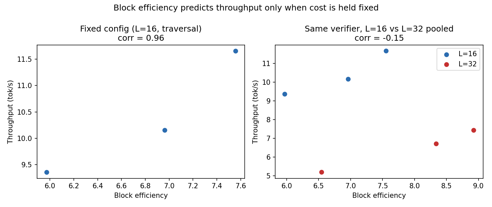
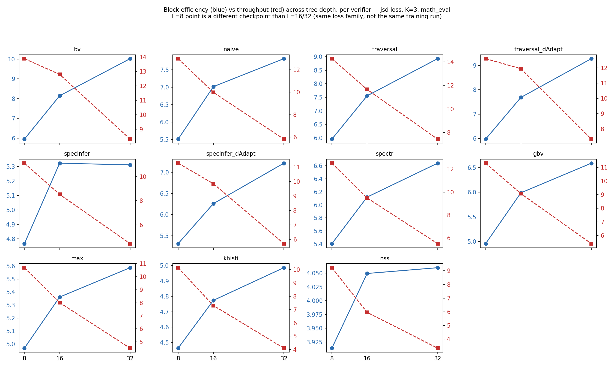

# GPU profiling: the bigger teacher was not the bottleneck. The smaller draft was.

In [my previous post](02_block_efficiency_vs_tokens_per_second.md), I talked about how tokens per second depends on hardware. I assumed the big teacher was the expensive part of every run. I was in for a surprise.

## Why the "cheap" draft model was the expensive part

Over 3,200 eval runs, spanning different losses, verifiers, K, L, and checkpoints, the small draft model consumed most of the measured draft-plus-target inference time, not the large teacher. Draft time was 78 to 94 percent of combined draft-plus-target time, averaging 85 percent, and the draft never stopped being the majority of the time in any single sweep. Even after making the teacher four times larger, the draft was still where most of the measured time went. That is the actual surprise here, not a specific percentage.

Target cost nearly doubled as expected going from the 8B teacher to the 32B one, 48ms to 84ms per block. Draft cost did not move with it, 344ms with the 0.6B draft against 333ms with the 1.7B one, roughly flat, though two model sizes is not a scaling curve. Making the teacher four times larger increased target latency substantially, but not enough to make it the dominant cost: draft share fell only from 88 to 80 percent.

This evaluation harness runs one prompt at a time, which is exactly why the draft's cost shows up so plainly here. The draft's rollout runs sequentially, one small CUDA kernel launch per depth step, 8, 16, or 32 times depending on tree depth. What that sequential, launch-per-step path costs, dispatch, synchronization, bookkeeping, versus the math itself, is consistent with the flat utilization numbers below, but those counters cannot say which one dominates. That needs a CUDA timeline, not aggregate utilization.

With an increase in tree depth, draft time increased far more than target time. Going from L=16 to L=32 doubles the number of sequential depth steps the draft has to construct, so draft time per block nearly doubling too, 575ms to 1122ms, is expected. The target still evaluates the whole finished tree in one batched pass, so its time barely moves, 56ms to 81ms. Doubling the tree depth makes the draft even more of the bottleneck. Model size was not predicting the bottleneck. Execution structure was.

## Was the memory bus the bottleneck?

The 32B teacher held about 66 GB on an 80 GB card, yet its memory-bus reading was 13.2 percent, barely above the 8B teacher's 12.2, and compute utilization sat at 31 to 34 percent for both. These readings come from NVML, the same driver library behind `nvidia-smi`. They are activity counters, the percent of time each resource was doing anything at all, not measurements of achieved FLOPs or memory bandwidth, so they cannot by themselves identify a bottleneck. NVML utilization could not identify the bottleneck. Decomposing wall-clock time did.

Low activity on both counters is consistent with the GPU spending most of its time between small draft calls rather than continuously busy on either kind of work. PCIe traffic rules out one culprit in the meantime: 77 MB/s back from the GPU against 17 MB/s out, both orders of magnitude below link capacity. That rules out sustained bandwidth, not latency from many small synchronous transfers, a different failure mode entirely.

## How do I use block efficiency results to predict throughput?

Hold tree depth fixed, only the eval dataset varies within one verifier at a time, same checkpoint throughout: block efficiency and throughput move together tightly, mean within-group correlation 0.96 across 33 groups (three eval datasets per group, gsm8k, math, and olympiad). Any single one of those comes from just three points and should not be trusted alone, the histogram of all 33 is what carries the claim. Different verifiers do move block efficiency by different amounts and cost somewhat differently to run, but that cost difference is small next to the draft's own, which is most of a block's total time.

*One correlation per group, 33 groups total, each group holding tree depth, verifier, and checkpoint fixed while only the eval dataset varies. Nearly every group clusters near 1.0.*

Tree depth is what actually breaks the proxy, because it restructures the draft's cost directly: the L=16 to L=32 result above is the clearest case, block efficiency rose while throughput fell.

This was not specific to traversal, the verifier used above. Across eleven verifiers at the same tree shape, throughput fell from L=8 to L=32 in every single case, and block efficiency rose in ten of eleven, specinfer was essentially flat past L=16.

*Left: block efficiency vs tree depth. Right: throughput vs tree depth. Same verifier, same color, in both panels. The L=8 point comes from a different checkpoint than L=16 and L=32, same jsd loss family, not the same training run, so treat it as directional rather than a strict controlled comparison.*

Block efficiency is a reliable proxy for throughput within one fixed tree depth and verifier, the two things that set how much draft and target work a block actually costs. It stops being one across different tree depths, the clearest case here: going from L=16 to L=32, it points the opposite way from throughput.

## How production systems get around this

A real serving stack does not eat that cost the way this harness does. [Continuous batching](https://blog.vllm.ai/2023/06/20/vllm.html), the technique behind vLLM, shares each small draft step across many prompts in flight instead of paying for it one at a time, though that mainly raises aggregate serving throughput rather than single-request latency, and batching speculative work is its own harder problem, different requests accept different lengths and build different tree shapes. [CUDA graphs](https://pytorch.org/docs/stable/notes/cuda.html#cuda-graphs) replay a captured GPU sequence instead of dispatching it fresh every step, though dynamic shapes can complicate capturing them cleanly. Both are plausible ways to cut the overhead observed here, not confirmed ones, quantifying either needs a timeline profile and a real serving implementation, neither of which this harness has.

## The lesson

A higher block efficiency does not mean higher throughput once the cost of producing the tree changes, tree depth was the clearest example, deeper trees accepted more tokens per target call while making the system slower. Do not infer the bottleneck from model size, and do not stop at the metric you optimized. Profile the path that actually determines wall-clock time.

---

Part of a series on building a speculative decoding for LLM inference research platform. Post 3.
