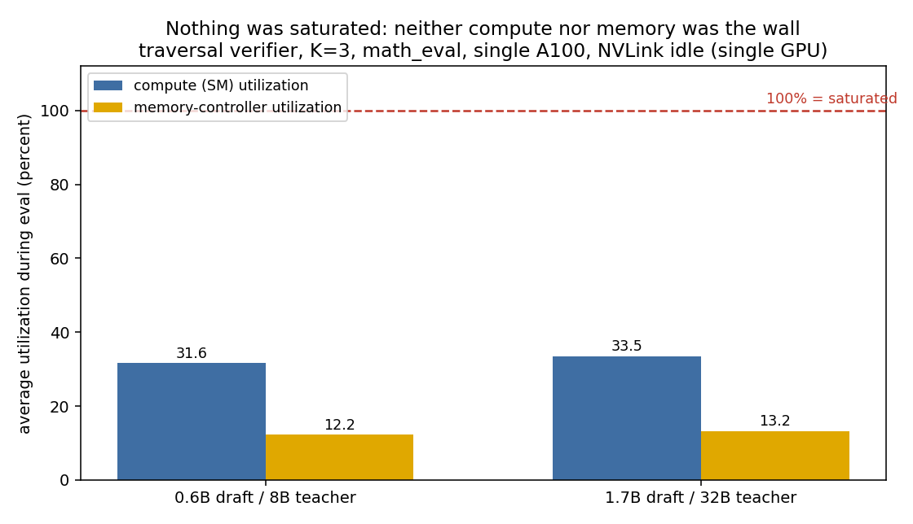

# GPU profiling: the expensive GPU was barely working

In post 2 I said GPU utilization during evaluation sat around 31 percent, and used it to argue tokens per second is the wrong metric. This post is about what I did to get that number, and the more uncomfortable thing it turned out to mean.

## Benchmarking tells you the number, profiling tells you why

Benchmarking is easy: run it, time it, report tokens per second. It tells you how fast, never why. Profiling is the other question, where did the time actually go, and which resource was the wall.

So I added a telemetry sidecar to the eval harness (`telemetry.py`). It polls the GPU through NVML on a background thread while the eval runs, and records, per run, the averages of a few things: compute utilization (how busy the streaming multiprocessors were), memory controller utilization (how hard HBM was being driven), PCIe traffic in both directions, NVLink traffic if any, plus clocks and temperature. Every number below is a column in the committed results CSV, not something I eyeballed.

## The roofline question

Every kernel is bounded by one of two things. Either it is compute bound, the math units are the bottleneck and memory feeds them fine, or it is memory bound, the math units sit idle waiting for weights to arrive from HBM. Single token decoding is supposed to be firmly memory bound: to produce one token you stream the entire model's weights through the chip and do very little arithmetic with them.

Post 2 already showed the roofline read that confirms this. Going from the 8B teacher to the 32B teacher is 4 times the parameters, but time per target call only went from about 49 to 86 milliseconds, less than double, not quadruple, and compute utilization barely moved. If it were compute bound, 4 times the math would have cost roughly 4 times the time. It did not. So the target model is memory bound, as expected.

## The uncomfortable part: nothing was saturated

Here is what the fuller telemetry showed, and it is not what "memory bound" alone would predict.

*Average utilization during eval. Compute sat at 31.6 percent for the 8B run and 33.5 for the 32B run. The memory controller was even lower, 12.2 and 13.2 percent. Both a long way from saturated.*

If decode were cleanly memory bound in practice, I would expect the memory controller pinned near 100 percent and compute low. Instead both were low. Memory was only about 12 percent utilized. Nothing was the wall in the usual sense, because at batch size one, with a tiny draft generating one token at a time, the real bottleneck was upstream of the GPU entirely: the CPU launching a stream of small kernels, one per token, and waiting on each. This is dispatch bound, not compute bound and not even memory bandwidth bound. The GPU spent most of the run idle, waiting to be told what to do next. That matches post 2's other number, the draft's own generation loop dominating wall time at that 31 percent occupancy.

The precise version is worth saying because it is the kind of distinction an interview probes: decode is memory bound in the regime the roofline assumes, a saturated pipeline. This run was not in that regime. It was starved further up, at kernel launch, so neither hardware resource ever got the chance to become the limit.

## One more thing the traffic showed

PCIe traffic was lopsided: about 77 MB/s coming back from the GPU to the host against about 17 MB/s going out to it, on both pairs. Roughly four times as much flowing back. That is the shape of a chatty loop, each step ships a little work to the GPU and pulls results back, over and over, rather than doing one big batched transfer. Same story as the utilization, from a different angle.

## What I did not measure, and why the empty columns are honest

The harness also records NVLink traffic, the high speed link between GPUs. On every run those columns are empty, and that is not a bug. Everything here ran on a single GPU, so there was no interconnect traffic to record. That is the honest boundary of this work: it is single GPU profiling. Multi GPU interconnect analysis, NVLink and NCCL collective behavior, the thing that actually matters once a model is sharded across a rack, is exactly what I did not do, and the empty columns are the proof of where the work stopped.

## The lesson

Profiling changed my conclusion, it did not just decorate it. I went in assuming the big model was the cost. The telemetry said the big model was mostly idle and a cheap model's launch overhead was the real ceiling. Knowing which of compute, memory bandwidth, or dispatch is actually your wall, and being able to show it from counters rather than guess it from wall clock time, is the difference between benchmarking a system and understanding one.

---

Part of a series on building a speculative decoding research platform. Post 3.
