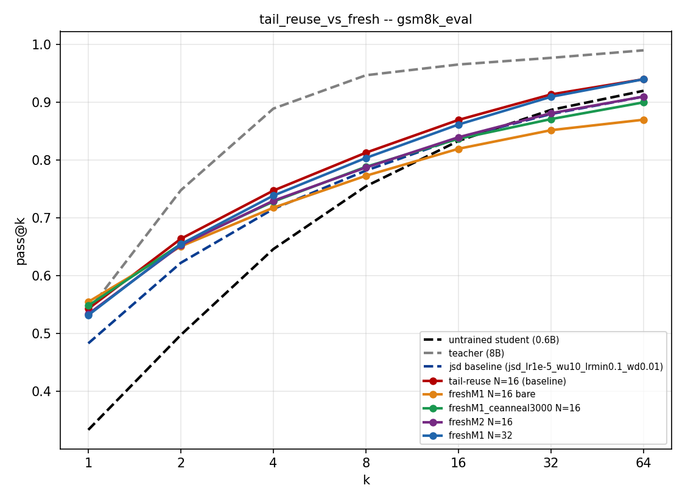

# Measuring the noise floor

This is post 3 in my series on building a speculative decoding platform. It is about the habit that saved me from reporting things that were not true.

Early on I got excited about a result. One of my training methods looked like it beat the baseline by a wide margin. I wrote it down as a real win.

It was not. When I went back and checked the raw numbers row by row, the win came from comparing two different settings that were not supposed to be compared. The number I had cited as a large gain was measured under one setting. The baseline was measured under another. Once I lined them up correctly, the real difference was tiny. It sat well inside the range where I could not tell it apart from luck.

That mistake taught me the single most useful habit of the whole project. Before believing any improvement, measure how much your numbers move on their own.

Here is what that means in practice. I took configurations that were basically the same and ran them, and I looked at how far apart their scores landed just from randomness. On my setup, with one hundred evaluation prompts, that spread was around 0.10 to 0.15 in block efficiency. So any improvement smaller than about 0.15 was inside the noise. It could be a real effect. It could also be the same thing that makes two near identical runs disagree. I had no way to tell them apart.

So I drew a line. Any change smaller than that spread got greyed out in my analysis. Not called a win. Not called a loss. Just, not distinguishable from noise.

*The dashed lines are the untrained student at the bottom and the teacher at the top. Every solid line is a different training variant I swept. They sit bunched together, close enough that telling them apart means nothing until you know how much a single run wobbles on its own. That is what the noise floor measures.*

This sounds obvious written down. It is not obvious in the moment. In the moment you have a number that is bigger than the baseline and you want it to be real. The noise floor is the thing that stops you from fooling yourself, because you set it before you look at the result you care about.

It also changed how I read other people's claims. A single number that beats a baseline means very little on its own. What matters is whether it beats the baseline by more than the run to run wobble, and whether it holds across more than one setting and more than one random seed. A lot of my project ended up being not, this method wins, but rather, this method does not clear the noise floor, so I cannot say anything yet.

That is a less exciting story to tell. It is also the honest one, and it is the reason I trust the few results I did keep.

The lesson: measure your noise before you measure your improvement. If you do it the other way around, you will always find a win, because noise always hands you one.

---

Part of the series. This is post 3.
