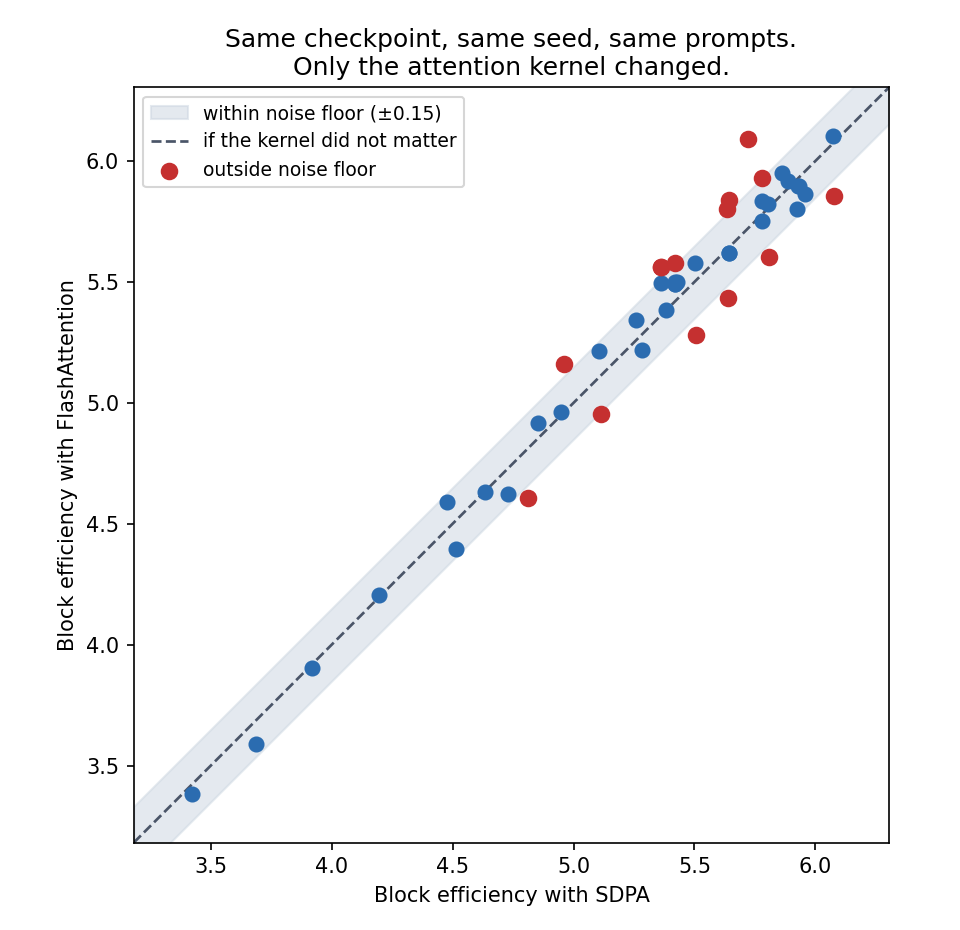

# Scientific computing: I sped up my eval, and it started giving different answers

My evaluation was slow. One verifier on one hundred prompts took fifteen to twenty minutes, nine verifiers per checkpoint was close to three hours, and across three datasets it was most of a day. I had dozens of checkpoints. So I went looking for something faster, and found FlashAttention. Around the same time I got access to an H100 where it was supported, so I moved some runs onto it and kept the rest on my A100. I expected a free speedup and nothing else. I was wrong.

## What SDPA and FlashAttention are

Attention is the most expensive operation in these models, and there is more than one way to compute it. [SDPA](https://pytorch.org/docs/stable/generated/torch.nn.functional.scaled_dot_product_attention.html) is PyTorch's built in default. [FlashAttention](https://arxiv.org/abs/2307.08691) is a faster implementation that never writes the large intermediate attention matrix to memory. Same math, different order of arithmetic, and it only runs on Ampere generation GPUs or newer, which is why it worked on my A100 and H100 but not the older free tier cards I started on.

## Why the same checkpoint gave two different scores

Running evals in parallel across both machines, I saw something that should have been impossible: the same checkpoint, the same fixed seed, scored two different block efficiencies depending on which machine ran it.

The cause was silent. The library picks the attention backend based on whether FlashAttention happens to be installed, and only one machine had it. So the same code quietly ran two different implementations. These models run in bf16, which has far less precision than fp32, and doing the same math in a different order can change the last bits of the result. Normally that does not matter.

But speculative decoding turns a tiny numerical difference into a discrete decision: accept or reject. Two values sitting close to the threshold, and a small difference flips it. Once one token flips, the rest of the generation follows a different path. The gap I measured reached about 0.2 block efficiency, the size of my run to run noise floor, leaning in neither direction.

*Each point is one evaluation cell: block efficiency under SDPA on the x axis, under FlashAttention on the y axis. If the kernel did not matter, every point would sit on the dashed line. The red ones land outside the run to run noise band, from nothing but the kernel.*

## One backend could not run the tree at all

There was a separate issue underneath this one. To verify a whole tree of proposed tokens in one pass, the target model uses a custom mask describing which tokens are ancestors of which. This comes from the verification step itself, not the training loss, so it holds for every checkpoint. The drop in FlashAttention path only accepts ordinary causal or padding masks, so it crashed on the tree mask. That is not a fundamental limit: production systems run tree verification on fast custom kernels all the time. [SpecInfer](https://arxiv.org/abs/2305.09781) introduced one; EAGLE and Medusa ship their own. I had no such kernel, so the target stayed on SDPA and only the small draft could switch to FlashAttention. That is why my logged backend read as a mix: draft on FlashAttention, target on SDPA.

## The lesson

The fix was simple once I understood it. Pin one backend, log which one ran, compare like with like. When I audited old results, some comparisons had mixed backends, so I flagged those rather than trust the difference as a model effect.

Low precision differences are usually harmless. But put a hard decision boundary downstream, and speculative decoding is exactly that, a tiny numerical difference becomes a measurable experimental signal. The measurement was real. Blaming it on the model would have been the mistake.

---

Part of a series on building a speculative decoding for LLM inference research platform. Post 4.
