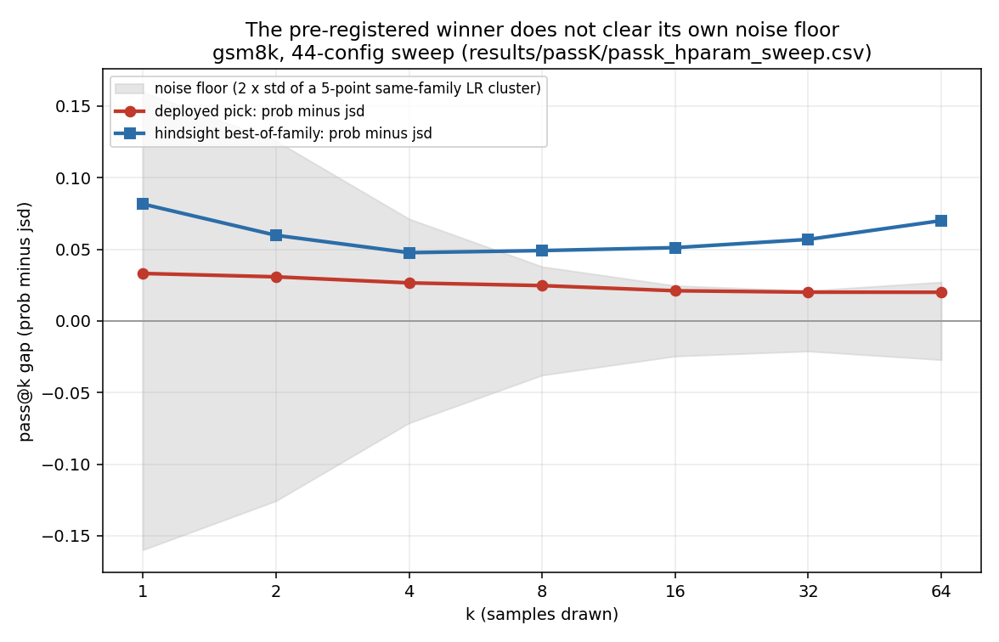

# Experimental methodology: the sweep, the seeds, and the eval set you did not train on

Post 2 ended on a partial derivative: hold hardware and the serving stack still, and the only thing left free to move is the one variable you actually care about. That sounds like it should settle things. It does not, and the reason is worth sitting with.

Speculative decoding's accept or reject step is a probability draw, not a lookup. Even with the exact same checkpoint, the exact same prompt, and every other variable frozen solid, the number you measure still has width to it, because the sampling itself is random. Freezing everything else does not remove the noise. It just makes sure the noise left over actually belongs to the one thing you meant to test.

So the real question was never just "did the number move." It was "did it move by more than the width of the noise it was always going to have anyway." That took a hyperparameter sweep, seed discipline, and a hard look at which eval set I was even reading the answer from, and it escalated through stages I did not see coming at the start.

## The sweep is not optional, it is where you find out what a "reasonable" setting actually does

Before any of this, there was a 44 configuration hyperparameter sweep, learning rate, warmup, weight decay, grad clip, CE anneal, run against pass@k on three eval sets. The reason it mattered: a single, perfectly reasonable learning rate choice swung gsm8k pass@1 by 0.225, from 0.343 at one end to 0.568 at the other, nearly the entire spread across all 44 configs. Report that one number and you would conclude learning rate is make or break.

Then look at the same two configs at pass@64: 0.92 and 0.96, a gap of about 0.04. Same runs, same models, opposite conclusion, depending only on which k you happened to plot. The sweep is not exploration for its own sake. It is the only way to find out that a result's truth value depends on where you looked.

## Two different sweeps, and they are not the same kind of knob

Worth separating cleanly, because they get confused. Training time knobs, learning rate, warmup, weight decay, grad clip, CE anneal timing, how many teacher rollouts per prompt, decide what checkpoint you end up with. Eval time knobs, tree width, draft length, which verifier, which dataset, decide what you learn about a checkpoint you already have. A training time sweep changes the model. An eval time sweep only changes the question you are asking it. Tuning an eval knob and believing you improved the model is an easy mistake to make, and I made it more than once.

Neither sweep is glamorous. It is running one config, waiting, reading a number off a dashboard, deciding if it cleared the noise floor, and running the next one. Most of the actual calendar time in this project was this loop, not any single clever idea.

## The learning rate has a real sweet spot, and here is the shape of it

My mentor described this before I had the data to show it: too high and training diverges, too low and it never gets anywhere in the step budget you actually have. The shape is not a guess, it shows up directly in the sweep.

*Left: the full range. Both losses climb through the low end, sit on a plateau, then fall off a cliff past 1e-4, the collapse zone. Right: zoomed into the healthy region, JSD keeps improving up to 1e-5 before dipping, prob is closer to flat and noisy across the same range.*

The plateau is not instant, and the cliff is not the same speed at every point past it. A separate view of the same sweep, tracking what fraction of runs are still healthy at each training step, shows the collapse timing directly: the healthy band, 1e-6 to 1e-5, never collapses across the whole run. At 1e-4 runs collapse, but gradually, staggered out to about step 2000. At 3e-4 and above, collapse is almost immediate. So "too high" is not one cliff, it is a spectrum from mild and slow to catastrophic and instant, and the sweep is what tells you which side of that line a given learning rate sits on before you commit a full run's worth of compute to it.

## When nothing clears noise, how do you actually pick

Most of the other knobs in the sweep did not move block efficiency beyond its local noise floor at all, grad accumulation, teacher top-k, weight decay, several others. That raises the honest question: if nothing wins cleanly, what does "we picked the best one" even mean.

The sharpest example of why this matters is teacher temperature. Ranked by block efficiency alone, 0.7 beat 0.5 beat the default. Ranked by pass@k, the order flipped completely, the default beat 0.5 beat 0.7, and the default cleared the noise floor by the widest margin of the three while 0.7, the best-looking point on block efficiency, cleared it nowhere. The value that actually shipped was the default, the worst performer on the metric I was directly optimizing, because it was the best performer on the metric that generalizes.

That is the philosophy, stated plainly: when a knob does not clear its own noise floor, keep the default rather than let noise crown a winner, and when two metrics disagree about which value is best, trust the one measured further from what you are directly optimizing. Two other knobs, CE anneal step count and the LR schedule's minimum ratio, followed the same pattern: the setting that won on block efficiency lost on pass@k. Picking a hyperparameter is not always picking a winner. Often it is refusing to let a number that has not earned trust make the decision for you.

## One hundred prompts was not enough

The first stage was running a config a few times and watching how much the number wobbled on its own, with nothing else changed. At one hundred evaluation prompts, that wobble in block efficiency sits around 0.10 to 0.15, purely from run to run variation. Any claimed improvement smaller than that is not a result yet. I started graying those out in my own analysis instead of reporting them.

The pass@k sweep sharpened this further: the noise floor is not one number, and it does not even move the same direction on every dataset. On gsm8k, near its ceiling, the floor shrinks about sixfold as k grows, 0.179 at k=1 down to 0.024 at k=16. On olympiad, far from its ceiling, the floor grows with k instead, 0.035 up to 0.057. On block efficiency the floor was measured at roughly 0.004 near one learning rate and 0.20 near an adjacent one, a fiftyfold difference between two nearby settings. A delta has to be checked against the noise floor at that specific point, never a single project wide constant.

## One seed was not enough

I learned this one the hard way. One training run, a combination of plain distribution matching, a depth weighted curriculum, and a tree shaped loss, had a headline number, a block efficiency gain of about 0.293 over the baseline, well above the 0.10 to 0.15 floor, which made it look real. When I went back to write it up properly and pulled the raw rows, the comparison was wrong. The 0.293 came from reading a result at a tree width of one and comparing it against the baseline's number at a tree width of three, two different settings, not the same one. Lined up correctly, at the same tree width on both sides, the real difference was 0.03. Inside the noise. Not a result at all.

The sweep data has its own version of this trap, and it is worth knowing because it points the wrong way: the pre-registered deployed pick beat the baseline by only 0.020 to 0.021 at k=16/32/64 on gsm8k, every one of those gaps below the 0.024 to 0.030 floor at that k. Meanwhile a config picked in hindsight, after seeing every result, cleared the floor comfortably at every k. The deployed, honestly pre-registered choice was noise. Only the cherry picked one looked like a win.

*Red is the pick I actually committed to before looking at every result. Blue is the best of the same family, chosen after seeing everything. Grey is the noise band. Only the hindsight line clears it.*

## One dataset was not enough, and this is an eval time choice, not a training one

Everything in this project trained on the same dataset, math_hard. But evaluation ran across three sets of increasing difficulty, gsm8k, math_eval, and olympiad, and which one I measured on mattered almost as much as which checkpoint I measured. On gsm8k, the untrained student was already close to the teacher, 0.920 versus 0.990 at k=64, a small gap, and nearly every checkpoint sat close to that ceiling too, so the dataset barely separated a good run from a mediocre one. On olympiad the untrained student was far from the teacher, 0.240 versus 0.330, and the spread between checkpoints was real and visible. If I had only looked at gsm8k, I would have concluded nothing mattered, when really gsm8k just could not see the differences at that point on the curve.

The distinction worth being precise about: this is not a training data problem, every checkpoint saw the same math_hard training set. It is an evaluation choice, made after training was already done, and it changes what conclusions the same checkpoint supports depending on which held out set you happened to grade it against.

## One model pair was not enough

This is the one that stretched the point furthest. A training method that beat the baseline cleanly on a smaller draft and teacher pair did not cleanly repeat on a bigger one. The gains flipped sign depending on how far ahead the draft was allowed to guess, instead of the same clear pattern the smaller pair had shown. The part that made me careful rather than just disappointed: I never even measured the noise floor for that bigger pair. Every number I had for it came from a single run. So I could not call it a real failure to replicate, only that I did not yet have enough runs to say anything with confidence either way.

## And every bit of this was still one model family

Here is the limitation I have not closed. Every escalation above, more prompts, more seeds, more datasets, more model pairs, still only ever touched one family of models, Qwen. A claim solid enough for a paper needs the same effect checked against other families entirely, Gemma, GPT, Llama, not just more seeds and datasets inside the one family already tested. That escalation is the one I have not done, and it is worth saying plainly rather than pretending the story is more finished than it is.

## What this actually teaches

Every escalation above traces back to the same cause. Speculative decoding's randomness does not go away just because every other variable was held perfectly still, it survives the partial derivative. The dataset axis is a different trap, not randomness but where on a difficulty curve you happen to be standing. The model family gap is different again, not noise but reach, how far a result actually generalizes. Knowing which of the three you are looking at is most of the job.

## Further reading

Chen et al., [Evaluating Large Language Models Trained on Code](https://arxiv.org/abs/2107.03374) (2021), the paper the pass@k estimator used throughout this series comes from.

---

Part of a series on building a speculative decoding research platform. Post 6.
