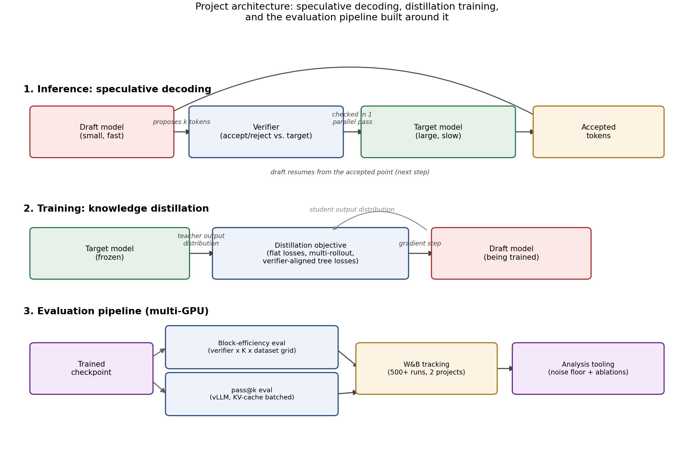

# Capacity planning: fitting a 32B model, then serving it

This is post 7 in my series. It is where I actually learned how GPU memory works, and where I learned that generating text at scale is a systems problem, not just a modeling one, because I had no choice on either front.

## The memory budget is not one number

The project started on a 16GB Colab GPU. It ended on an 80GB A100. In between it ran on a 30GB Kaggle GPU and a 40GB A100. Every step up taught me something, because at each size a different thing was about to run out of memory.

Start with the big teacher model, the 32B one. A parameter in full precision is two bytes. 32 billion parameters times two bytes is about 64GB. That is just the weights sitting there doing nothing. It does not fit on a 40GB card at all. It barely fits on an 80GB card, and only if almost nothing else is competing for room.

But the weights are not the whole story, and this is the part I did not appreciate before. When you train, you also store optimizer state. The common optimizer keeps two extra numbers per parameter, which roughly triples the memory the trainable model needs compared to the weights alone. Then there are activations, the intermediate values you keep around to compute gradients. And in speculative decoding there is also the KV cache, which is the memory that holds the attention keys and values for the tokens generated so far. That cache grows as the sequence grows.

So the real question was never just, do the weights fit. It was, do the weights plus the optimizer state plus the activations plus the cache fit, all at once.

Because I started small, I could not just throw memory at it. I had to give things up and add them back as I got bigger cards. Early on I used LoRA, which trains only a small set of extra weights instead of the whole model, so the heavy optimizer state only covers the small part. I also quantized things, which means storing numbers in fewer bits to save room. I quantized the optimizer state. At the tightest points I even quantized the teacher model itself.

As the GPUs got bigger, I peeled these off one at a time, in order. First I could afford a full optimizer again. Then I could keep the teacher in full precision instead of a quantized version, which mattered because a quantized teacher gives slightly noisier targets. By the 80GB card I was doing full precision training with no tricks, which is the cleanest setup and the one I trusted most.

The lesson is that memory is not one number. It is a budget with several line items, and the line item that kills you changes as you scale. Weights, optimizer state, activations, cache. Knowing which one is about to overflow is most of the battle, and you only really learn it when a card says no.

One distinction worth being precise about, since it is easy to blur: everything above is GPU orchestration, scheduling many independent single GPU jobs across four hardware tiers, packing several small runs onto one card when they fit, one eval per GPU when they did not. It is not distributed training. Every model in this project, including the 32B teacher, fit entirely on one GPU. There was never a model split across GPUs with NCCL collectives, no tensor or pipeline parallelism, no cross GPU communication to reason about. Orchestration and distributed computation solve different problems and get confused often. This project only needed the first.

## Future work: what changes past one GPU

Everything above assumed a model that fits on a single card, true for every model in this project, even the 32B teacher. That assumption breaks past a certain size, and the next problem is worth naming rather than skipping. A 70 billion parameter model in full precision is roughly 140GB of weights alone, before optimizer state, activations, or cache, and that does not fit on one 80GB H100. It has to be split across several GPUs, and how well that works depends on how those GPUs actually talk to each other, not just how many of them there are.

An 8 GPU H100 server has 640GB of HBM in total, but only if the GPUs can share work efficiently. With NVSwitch, every GPU gets a full 900GB/s of bandwidth to every other GPU at once, and that number does not shrink as more GPUs join the exchange. Without NVSwitch, that same 900GB/s has to be split into separate point to point links instead, about 128GB/s to each of the other seven GPUs in an eight GPU box, so the bandwidth any pair actually gets depends on how many GPUs are talking at once. Same hardware otherwise, a very different ceiling on how fast the GPUs can cooperate.

From there the real question is how you split the work, model parallel, dividing the model itself across GPUs, against workload parallel, dividing which requests go where while keeping a full copy of the model on each. I have not built either. It is the direct next problem past everything else in this post, and it is where I would start if I ever needed to move past a single card.

## Fitting the model was half the problem, serving it fast was the other half

At one point I needed to check something different from block efficiency. I wanted to know if a trained draft model could actually solve problems, so I needed to sample many full answers per problem, tens of thousands of samples in total, and grade them. My first instinct was the simple one. Load the model, call it in a loop, collect the outputs.

That was far too slow, and understanding why taught me two ideas I had heard of but never really felt.

The first is the KV cache, the same memory structure from the budget above, now seen from the serving side. When a model generates text one token at a time, each new token attends to all the tokens before it. If you recomputed everything from scratch at every step, you would redo the same work over and over. Instead the model saves the attention keys and values for the tokens it has already seen, and reuses them. It is what makes generation not scale terribly with length. It is also why long sequences eat so much memory, because the cache grows with every token, the same fact that made the memory budget above so tight in the first place.

The second idea is what a real serving engine does with that cache. I used vLLM for this part. Two things it does mattered to me.

One is paged attention. A naive setup gives each sequence one big block of memory for its cache. When sequences have different lengths and finish at different times, that memory fragments and gets wasted. Paged attention instead breaks the cache into small fixed pages, like how an operating system manages memory. Nothing gets stranded, and a finished sequence frees its pages immediately for the next one.

The other is continuous batching. In a naive batch you wait for every sequence in the batch to finish before starting new ones, so the whole batch moves at the speed of its slowest member. Continuous batching admits a new sequence the moment a slot frees up. The GPU stays busy instead of idling while it waits for one long straggler.

Put together, these are why the sampling job that would have taken a very long time in a plain loop finished in a reasonable one.

*The evaluation half of the platform. The pass at k path runs on vLLM with a batched KV cache, in its own isolated environment, kept separate from the training stack.*

There was one more thing I had to respect. vLLM pins specific versions of its dependencies, and those fight with the versions my training code needed. So I did not install it into my training environment. I gave it a completely separate environment and ran it as its own pipeline, with its own resume logic so that if it got killed it did not redo finished work.

## The lesson, on both halves

Capacity planning and serving are the same discipline applied at two different times. Knowing which resource is about to overflow, weights, optimizer state, activations, cache, memory bandwidth, decides whether training even starts. Knowing what a serving engine does with that same cache, paged attention, continuous batching, decides whether generation finishes in a reasonable time once training is done. I knew the words KV cache and vLLM before this project. I did not understand either one until a memory budget said no and a simple loop was too slow.

## Further reading

Kwon et al., [Efficient Memory Management for Large Language Model Serving with PagedAttention](https://arxiv.org/abs/2309.06180) (2023), the vLLM paper, for paged attention and continuous batching in full. NVIDIA, [NVLink and NVSwitch Supercharge Large Language Model Inference](https://developer.nvidia.com/blog/nvidia-nvlink-and-nvidia-nvswitch-supercharge-large-language-model-inference/), for the bandwidth figures used above.

---

Part of a series on building a speculative decoding research platform. Post 7.
