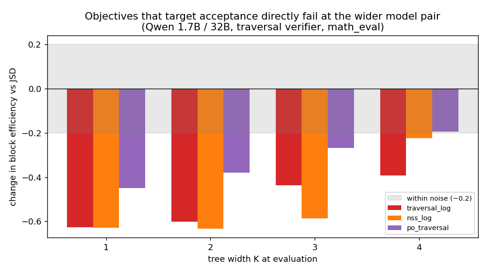

# The loss that matched my metric and still lost

Post 8. The result that changed how I think about training objectives.

I was optimizing block efficiency, which depends on an acceptance test between the draft and the target. So the obvious idea is to train the draft on an objective that targets that exact test. Match what you are graded on.

I tried it. It was the single worst objective I tested. Not by a little, and consistently. At the wider model gap it dropped block efficiency from the start.

*At the wider model pair, the objectives that target acceptance most directly all sit below the plain baseline, most of them at every tree width K.*

Same lesson from a second idea. Part of the acceptance signal fades deeper into the guess sequence, so its gradient is weak at depth. The standard fix is to move the objective into log space. When I applied it, results got worse, and at the wider gap training collapsed.

Both failed for the same reason. They poured gradient into deep, unlikely parts of the guess tree, positions the draft almost never reaches. The draft spent its limited capacity matching branches it would rarely visit, instead of getting the early, common tokens right, which are the ones that decide acceptance.

The objective looked aligned in its formula but was misaligned in where it sent the signal. The plain baseline put its effort in more useful places without being told to.

This is the lesson I repeat most. Matching the form of your metric does not mean the loss will train well. What matters is where the gradient lands, token by token. A loss can be correct on paper and still be a bad teacher.

I expected the opposite: closer to the metric, better to train. The data disagreed, twice. Now I stop asking does this match the metric, and ask where does this send the gradient.

---

Post 8. Next: two more ideas that failed, and why the data told me before any argument could.
