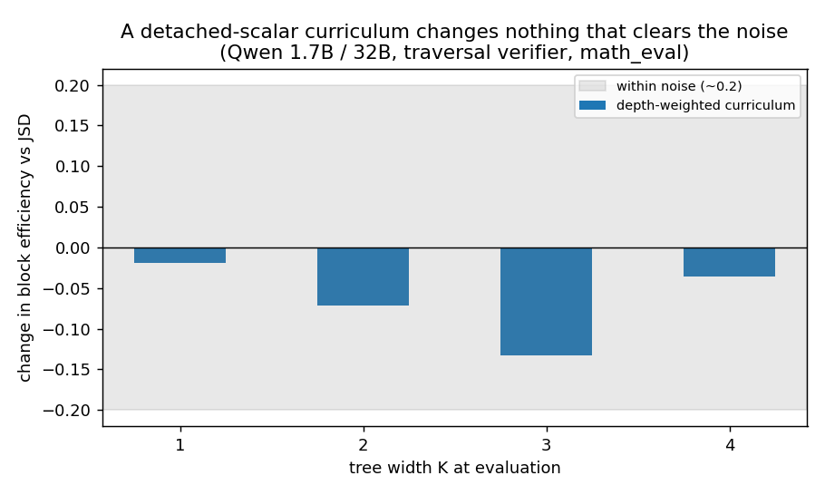

# ML fundamentals: two training ideas that failed

Post 9. Two things I tried that did not work, and learning to delete my own code.

First, a curriculum idea. Weight the training so the model focuses more on some prompts than others, based on how deep it currently gets. Sounds reasonable.

The problem was how I applied the weight. I multiplied the loss by a number computed separately, with no gradient through it. Multiplying the loss by a fixed number only changes how big the update is, not which direction it points. It is a volume knob. It cannot teach anything new. If the real problem is that the small model lacks the capacity to match the target, turning up the volume does not help. The data agreed.

*The curriculum moved block efficiency by less than the run to run noise at every tree width K. A volume knob, not a new lesson.*

Second, a reinforcement learning idea. Reward the draft directly for high block efficiency. This felt like the pure version of the goal.

It failed in a telling way. Block efficiency slid down steadily as training went on. Not a crash, a slow decline.

The reason: this kind of reinforcement learning pushes a model toward its own high reward behavior, concentrating on what it already does well. But acceptance needs the opposite. The draft has to spread out and cover the target's full range, including tokens it would not have picked. The method was tightening the model when it needed to broaden. It was not buggy. It was doing its job, and its job was the wrong shape for this problem.

I removed both. Across the project I reverted my own work many times, killing things that regressed or landed inside the noise. It felt like wasted effort the first few times. It is not. A clean no is a result.

The bigger lesson: I could not always argue in advance which ideas would fail. Both sounded fine out loud. The data told me first, and only then could I see why.

---

Post 9.
