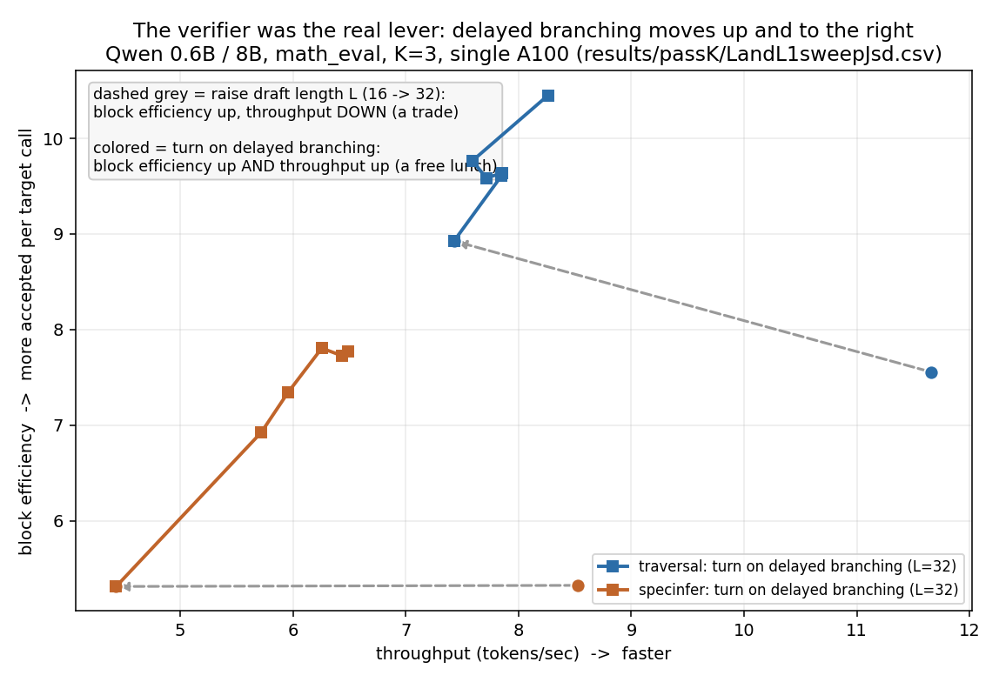

# ML fundamentals and systems: what worked, and why one metric was not enough to trust it

This is post 10 in my series, the finale. After a lot of things that did not work, here is what did, the honest limits on it, and the moment I realized my main metric was hiding things.

## The one training change that broke through

Most of my training ideas tried to reweight or reshape the loss on the same fixed set of teacher tokens. They all landed at about the same ceiling as the plain baseline. One change broke through, and it was not a cleverer loss. It was a change to the data the draft trained on.

The idea is called enrichment. Normally you take one greedy continuation from the teacher and train the draft to match it. Instead, I sampled several different continuations from the teacher, letting it vary, and trained on all of them. The draft sees a broader picture of what the teacher might say, not just the single most likely path.

This worked. On the smaller model pair, it beat the baseline on the deployment verifier, and the sweet spot was four sampled continuations. Fewer than that helped less. More than that, around six, started to fade, because the extra samples just repeated the same region and stopped adding new information. The gain also held on a harder dataset the model never saw in training, which is the stronger kind of evidence, since it is easy to win on data you trained on and harder to win on data you did not.

Now the honest part, because this is where it would be easy to overclaim. The win was clean on the smaller pair. On the wider pair, with the bigger models, it did not cleanly repeat. The numbers there flipped sign across settings, and I only had one random seed, so I cannot call it a real win at that scale. The most honest summary is that enrichment helped at one scale, in a measurable and repeatable way, and the jury is still out at the other.

## The strongest result came from the verifier, not the training

The biggest gain came from a different direction entirely, the verification side. My mentor had published a technique that delays where the draft's guess tree splits. Instead of branching into many candidates at the very first token, it commits to one stem and only splits later, at the point where the draft and target actually start to disagree. His paper only ever tested it on untrained draft models. I tested it on my trained ones.

It helped almost everywhere. The chart below shows the lift across every trained checkpoint on both model pairs. Verifiers that were already near their ceiling gained a little. Verifiers that were further behind gained a lot, in some cases over twenty percent. And stacking this on top of the enrichment training above gave the best single result I got.

*Delayed tree branching, every trained checkpoint, both model pairs. Almost all improved, and the weaker the starting point, the larger the lift.*

Here is the part that made this more than just another block efficiency number. Every training change I tried was a trade: raise the draft's guess length and block efficiency goes up while real throughput goes down, because a longer guess costs more sequential draft steps before the target ever verifies it. Delayed branching does not trade, it moves both at once. Turning it on took one verifier from 5.31 block efficiency and 4.43 tokens per second up to 7.81 and 6.26, both axes up together, on the same checkpoint, same hardware, nothing else changed.

*Dashed grey lines show the usual trade, raise the draft's guess length and block efficiency rises while throughput falls. The colored lines show what happens when delayed branching is turned on instead, both axes move up together.*

The lesson: when reshaping the loss kept hitting the same wall, the thing that actually moved the needle came from elsewhere, the structure of how the draft was verified, not the loss it was trained with. Sometimes the ceiling is not in the part you keep polishing.

## My main metric was hiding things

Block efficiency, my main metric, measures how well the draft matches the target's output. It does not measure whether the draft actually got better at solving problems. Those sound like the same thing. A single step distribution match and a whole answer correctness check were never guaranteed to move together, and with real checkpoints, not just as a hypothetical risk, they did not always.

To check the second thing directly, I built a second pipeline. For each problem, sample many answers, and check whether any of them is correct. This is called pass at k. If any of the k tries is right, the problem counts as solved.

This revealed things block efficiency could not see. Some checkpoints got better at getting the answer right on a single try, but worse when given many tries. Training had sharpened them onto one confident answer and narrowed their variety, exactly the wrong thing if you are going to sample many times. My main metric was happy. Pass at k showed the hidden cost. Not universal, most trained checkpoints beat the untrained student across the board, but at least two specific checkpoints on the harder math set fell behind it once k climbed past about sixteen. A property of specific checkpoints, not of training itself.

Which dataset I measured on mattered almost as much as which model I measured. On the easiest set, gsm8k, the untrained student was already close to the teacher, so there was little room for any checkpoint to separate itself, good runs and mediocre ones looked nearly the same. On the hardest set, olympiad, the untrained student started far behind the teacher, and the same checkpoints spread out clearly. If I had only looked at the easy set, I would have concluded that nothing mattered, when really the easy set just could not see the differences. All of this was an evaluation time choice, not a training one, since every checkpoint trained on the same math_hard data regardless of which set later graded it.

The chart below shows the pass at k picture across every trained checkpoint. Training closed part of the gap to the big teacher model, somewhere between a third and two thirds of it, but never all of it. There is a real ceiling to how much a small draft can absorb from a much larger teacher.

*Training closes part of the gap to the teacher, never all of it.*

And the honest closing note for the whole series. After accounting for run to run noise, most of the settings I swept did not produce a signal I could trust. That is not a failure. It is the result. A lot of careful measurement, a few real effects, and a clear map of what does not work and why. I would rather report that than a confident number that falls apart on a second look.

## The thread underneath every post in this series

LLM inference is a coupled system: training objective, draft distribution, speculation tree, verifier, kernels and numerics, hardware, and the evaluation metric itself are all links in one chain, and improving one link does not guarantee the chain improves end to end. [The 0.2 gain that was a rounding error](04_rounding_error_flashattention_sdpa.md) was the numerics link quietly lying to the metric. This post is two more examples at once, the verifier link mattering more than the training link everyone assumes matters most, and the evaluation link splitting into two disagreeing measurements. A lot of real research time goes into exactly this, checking whether a chain that looks simple on a whiteboard actually holds together once every link is measured separately.

Thank you for reading this far. If you went through the whole series, you saw the real shape of a research project: mostly plumbing, careful measurement, a lot of dead ends, and a few things that held up. That is what doing this work actually looks like.

## Further reading

Thomas et al., the delayed tree branching technique extended here to trained drafts (arXiv:2602.16994). Chen et al., [Evaluating Large Language Models Trained on Code](https://arxiv.org/abs/2107.03374) (2021), for the pass@k estimator.

---

This is the final post in the series on building a speculative decoding for LLM inference research platform. Start from post 1 if you want the full picture.
