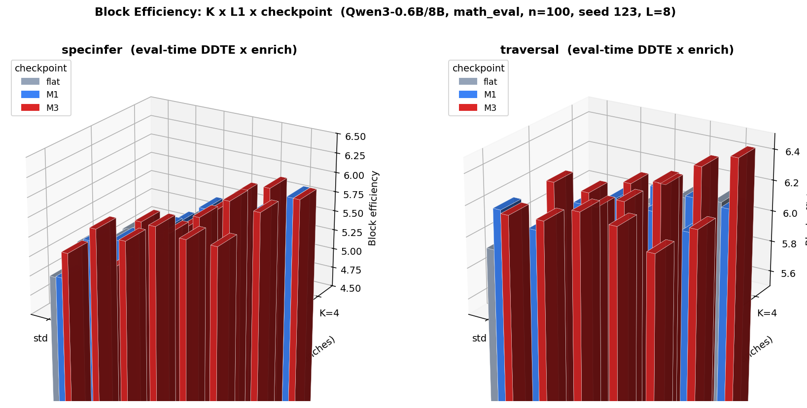

# Eval-Time Delayed Tree Expansion for Speculative Decoding
## A Research Note on Compositional DDTE + Distillation Training

**Scope:** one draft (Qwen3-0.6B) / one teacher (Qwen3-8B), one training dataset (math_hard), eval domain (math_eval), one seed (s123). n=100. Three checkpoints: `jsd_flat` (baseline), `jsd_flat_enrich_M1`, `jsd_flat_enrich_M3`. L1 ∈ {2, 3, 4, 5, 6} for specinfer; L1 ∈ {2, 3, 4, 5} for traversal; τ-lagged adaptive tested on both. Modes: traversal, specinfer.

**Data source (untouched):** all numbers in this note are derived from [`Results/jsd_enrich_ddte_results.csv`](../Results/jsd_enrich_ddte_results.csv) — the single canonical results file for the enrich + DDTE line of work (baselines, enrich M1/M3, and all delayed-tree variants). The tables below are pivots/derivations of `block_eff`; raw per-run rows live only in the CSV.
**Closest prior work:** DDTE (Thomas et al. 2026, arXiv:2602.16994) — applies delayed branching to untrained drafts using a neural MLP selector. Our contribution: composing eval-time DDTE with distillation-trained + enrich-trained drafts, and measuring how draft quality modulates the DDTE gain.

---

### Summary

**Method.** Two training phases: (1) JSD distillation of Qwen3-0.6B from Qwen3-8B on math (draft scores against single greedy teacher output); (2) *enrich* — fine-tune further using JSD loss on K **stochastically-sampled teacher continuations** per prompt. K=1 (M1) exposes the draft to one random teacher path; K=3 (M3) exposes it to three diverse paths per step, broadening coverage of the teacher's distribution beyond the greedy mode. DDTE is then applied **eval-time only** — no additional retraining for the delayed-branching structure. The delayed draft runs a K=1 stem for L1 steps, then expands to K branches for the remaining L−L1 steps. This tests whether the improved tree structure stacks additively with distillation+enrich training gains. Implementation: `delayed_draft.py`, invoked via `--L1` in eval.py.

**Key results** (one seed, n=100, L=8):

- **DDTE massively rescues specinfer at K>1; modest but real gain for traversal.** Specinfer+M3+dL5 reaches BE=6.015 at K=3 (+1.22 over standard specinfer M3 K=3 baseline of 4.795). Traversal+M3+dL5 reaches 6.418 at K=4 (+0.20 over traversal M3 K=3 baseline of 6.216).
- **Scope of SOTA claims (verified against all verifiers in our data):**
  - Traversal+enrich+DDTE (6.418, M3 dL5 K=4) is the **best result across all verifiers tested**, beating BV+enrich (6.283) by 0.14.
  - Specinfer+enrich+DDTE (6.015, M3 dL5 K=3) is the best within the specinfer family, but does not beat BV+enrich (6.283). It nearly closes the specinfer↔BV gap that was wide before DDTE.
- **Optimal L1 is checkpoint-dependent.** M3 peaks at L1=5 (K=3: 6.015, K=4: 5.866). flat and M1 peak at L1=6 (M1 K=4: 5.806). Stronger draft → lower optimal L1, consistent with optimal L1 ≈ mean(τ)−1.
- **Enrich compositional gain grows with L1.** M3−flat gap at K=4: +0.03 at L1=2, +0.27 at L1=4, +0.44 at L1=5. Stacking is strongest at each checkpoint's optimal L1.
- **Throughput recovery at L1=5–6.** Draft compute = L1×1 + (L−L1)×K units. At dL5 K=4: 5+12=17 vs root-branching 33. dL5 throughput is ~14–17 tok/s, matching standard specinfer; dL4 is slower (7–9 tok/s) due to Phase 1 overhead dominating at small L1.
- **τ-lagged adaptive (dTau) showed no detectable signal for specinfer** (−0.28 to −0.58 vs best fixed L1 across all checkpoints/K). Inconclusive for traversal. Not recommended.
- **Traversal optimal L1 is K-dependent.** K=3: dL4 > dL5 for all checkpoints. K=4: dL5 > dL4 for M3.

**Key analysis:**
- **Distillation amplifies DDTE** (dimension 1 confirmed): standard JSD distillation alone already improves over what untrained drafts would achieve with DDTE, by compressing divergence and shifting the optimal branching depth deeper.
- **Enrich further amplifies DDTE** (dimension 2 confirmed): the M3−flat enrich gap grows monotonically with L1 (+0.03 at L1=2, +0.27 at L1=5, K=3), confirming that each tier of draft quality extracts incrementally more from the delayed structure. Optimal (checkpoint, L1) pairs must be selected jointly.
- specinfer+M3+dL5 (6.015 at K=3) vs traversal+M3+dL4 (6.361 at K=3): gap narrows to 0.35 (from 1.42 at L1=0). Full closure likely requires training-time delayed expansion to remove off-policy mismatch.
- Traversal+DDTE (6.418) > BV (6.283) > traversal standard (6.216) > specinfer+DDTE (6.015). DDTE elevates traversal to the overall best in our setup.

**Open questions (for Rahul):**
1. Is training-time delayed expansion in scope (removes off-policy mismatch, may close the remaining gap)?
2. Is the off-policy mismatch the primary reason traversal gains are small and K-dependent?
3. Is one seed sufficient at these effect sizes for the specinfer result, or do we need two?
4. Can we use the MLP selector code for a proper single-pass delayed draft?

---

## 1. Motivation

DDTE (Thomas et al. 2026) identifies that draft↔target KL divergence grows monotonically with tree depth. OT verifiers (SpecInfer and variants) branch at the root (depth 1), wasting K paths in the low-divergence shallow zone and leaving the high-divergence deep zone with no diversity. Traversal avoids this structurally by accepting bottom-up. Thomas et al. test DDTE exclusively with untrained (base model) drafts.

Our study adds two dimensions DDTE did not test:

**1. Does distillation amplify the DDTE benefit?** Standard JSD distillation trains the draft to match the teacher's token distribution, reducing divergence across the sequence. If distillation compresses divergence uniformly, the optimal branching depth shifts rightward (deeper), and the DDTE gain over untrained drafts should grow. We test this by composing eval-time DDTE with a JSD-distilled checkpoint (`jsd_flat`) and comparing against the untrained-draft results from the paper.

**2. Does enrich distillation further amplify the DDTE benefit?** Beyond standard JSD distillation, we apply a second training phase — *enrich* — where the draft is fine-tuned on K stochastically-sampled teacher continuations per prompt (M1 = 1 path, M3 = 3 paths). Enrich pushes the draft closer to the teacher's full distribution (not just the greedy mode), further reducing divergence and increasing the mean acceptance depth. If the DDTE gain scales with draft quality, the enrich-trained checkpoints should yield larger DDTE improvements than the flat JSD checkpoint, and M3 should yield larger gains than M1. We test this prediction directly.

The **off-policy mismatch** is also new in our setting. DDTE's paper trains no model, so there is no mismatch. We train with root-branching trees and evaluate with delayed-branching trees. The draft was never trained on prefixes that include a K=1 stem of depth L1 followed by K branches of depth L−L1, which is a distribution shift at inference time.

---

## 2. Method: Delayed iid_draft

### 2.1 Standard iid_draft (Rahul's, unchanged)

`iid_draft(K, L)` samples K i.i.d. paths by expanding the draft cache to batch size K from the first token, running L autoregressive steps in parallel. All K branches diverge at depth 1 (the root).

### 2.2 Delayed iid_draft (ours, `delayed_draft.py`)

```
Phase 1: iid_draft(K=1, L=L1)       → single stem path of length L1
Phase 2: iid_draft(K=K, L=L-L1)     → K branches from stem tip
Stitch:  q_paths[k] = stem + branch[k][1:]   (length = L+1, same format as normal)
```

Key implementation detail: after Phase 1, `iid_draft`'s extra final forward pass adds tL1's KV to the cache. We trim it via `slice_cache` before Phase 2 so Phase 2 re-processes tL1 fresh across K expanded copies (prevents double-processing at batch expansion). Also: `branch_probs` keys are local to the branch root (e.g. `"3406"`) but `traversal_verify` expects global keys (`"760,31925,3406"`). We remap by prepending the stem prefix before merging into `q_probs_dict`.

### 2.3 Notation

| Symbol | Meaning |
|---|---|
| L1 | stem length (branch delay depth); L1=0 = standard root branching |
| L−L1 | branch length (diversity window) |
| dLX | mode suffix for fixed L1=X (e.g. `traversal_dL4`) |
| dAdapt | entropy-lagged adaptive L1 (shown to be inferior, see §4) |
| dTau | τ-lagged adaptive L1 (iter_L1 = max(1, prev_τ − 1), evaluated — showed no detectable signal for specinfer, mixed for traversal) |

### 2.4 Adaptive variants

**Entropy-lagged (dAdapt, deprecated).** After each iteration, read teacher entropy at depth 1 from the target pass (zero extra cost). Next iteration: if entropy < threshold → use L1=L//2; else → fall back to L1=0 (root). Shown to underperform fixed L1=4 because the binary L1=0 fallback is too aggressive.

**τ-lagged (dTau, evaluated — no signal for specinfer, inconclusive for traversal).** `iter_L1 = max(1, prev_τ − 1)` where `prev_τ` is `ver_node.depth` from the previous iteration. First iteration seeds with L//2. Evaluated across all checkpoints (flat/M1/M3) for K=2,3,4. For specinfer: consistently worse than fixed dL5 by 0.28–0.58 BE across all checkpoints. For traversal: within 0.04–0.17 of best fixed L1 at K=2,3, but −0.22 at K=4 (M3 dL5 decisively better). Not recommended. See §5.4 for analysis.

---

## 3. Experimental Setup

- Draft/teacher: Qwen3-0.6B / Qwen3-8B
- Training: jsd_flat (s123), jsd_flat_enrich_M1 (s123), jsd_flat_enrich_M3 (s123)
- Eval dataset: math_eval, n=100, seed=123
- L=8, K∈{2,3,4}, L1∈{2,3,4,5,6} for specinfer; L1∈{2,3,4,5} for traversal; τ-lagged adaptive (dTau) on both
- Modes: traversal, specinfer
- Baselines: L1=0 rows from prior results (same checkpoint, same K)
- Attn backend: SDPA (target must use SDPA for dict attention_mask in tree decoding)
- Runs logged with effective mode name (e.g. `traversal_dL4`) to `results.csv`

---

## 4. Results

All BE values below are derived from [`Results/jsd_enrich_ddte_results.csv`](../Results/jsd_enrich_ddte_results.csv) (n=100, seed=123).

### 4.0 Block efficiency landscape: K × L1 × checkpoint



Reading the chart: for **specinfer** (left), bar height climbs steeply with L1 — standard root branching (`std`) is the trough, dL5/dL6 the ridge, and M3 (red) sits on top at dL5. For **traversal** (right), the surface is nearly flat across L1 — the verifier is structurally insensitive to branch-delay depth, and the only standout is M3 dL5 at K=4 (the global peak, 6.418). The two panels visually encode the central finding: DDTE reshapes the specinfer landscape but barely moves traversal's.

### 4.1 Specinfer: L1 progression by checkpoint

Full L1 sweep for specinfer. Bold = checkpoint peak.

**K=3:**

| L1 | flat | M1 | M3 | M1−flat | M3−flat |
|---|---|---|---|---|---|
| 2 | 5.347 | 5.197 | 5.492 | −0.15 | +0.15 |
| 3 | 5.411 | 5.464 | 5.436 | +0.05 | +0.02 |
| 4 | 5.611 | 5.591 | 5.724 | −0.02 | +0.11 |
| 5 | **5.742** | 5.833 | **6.015** | +0.09 | **+0.27** |
| 6 | 5.744 | **5.900** | 5.960 | +0.16 | +0.22 |

**K=4:**

| L1 | flat | M1 | M3 | M1−flat | M3−flat |
|---|---|---|---|---|---|
| 2 | 5.037 | 5.128 | 5.068 | +0.09 | +0.03 |
| 3 | 5.234 | 5.410 | 5.371 | +0.18 | +0.14 |
| 4 | 5.437 | 5.581 | 5.707 | +0.14 | +0.27 |
| 5 | 5.428 | 5.546 | **5.866** | +0.12 | **+0.44** |
| 6 | **5.478** | **5.806** | 5.804 | **+0.33** | +0.33 |

**K=2:**

| L1 | flat | M1 | M3 |
|---|---|---|---|
| 0 (std) | 4.979 | 4.994 | 5.330 |
| dL2 | 5.511 | 5.564 | 5.728 |
| dL3 | 5.623 | 5.653 | 5.667 |
| dL4 | 5.625 | 5.674 | **5.937** |
| dL5 | 5.637 | **5.918** | 5.867 |
| **dL6** | **5.773** | **5.969** | 5.872 |
| dTau | 5.591 | 5.610 | 5.609 |

**Key findings:**
- M3 peaks at L1=5 for K=3,4. flat and M1 peak at L1=6 for K=4. **Optimal L1 is checkpoint-dependent**: stronger draft → optimal L1 is one step lower, consistent with optimal L1 ≈ expected-τ − 1 and stronger drafts having higher mean acceptance depth.
- The enrich compositional gap (M3−flat) grows monotonically with L1 at K=4: +0.03 at L1=2, +0.27 at L1=4, +0.44 at L1=5. Stacking is strongest at each checkpoint's optimal L1.
- L1=2 and L1=3 are inconsistent (M1 sometimes worse than flat at L1=2) — shallow delay puts branches where divergence is still low and provides little diversity benefit.
- L5→L6 increment for M1 K=4 is +0.26 (5.546→5.806): the largest single L1-step gain observed. M3 K=4 has negative increment at L5→L6 (−0.06) suggesting M3's optimal is exactly at L1=5.

### 4.2 Traversal: DDTE gain and K-dependence

Traversal absolute gains from DDTE are smaller than specinfer's but the final numbers are the highest across all verifiers. Results are K-dependent:

| K | L1 | flat | M1 | M3 |
|---|---|---|---|---|
| 3 | 0 (std) | 5.894 | 5.853 | 6.216 |
| 3 | dL2 | 5.988 | 6.116 | 6.199 |
| 3 | dL3 | 5.929 | 6.205 | 6.194 |
| 3 | **dL4** | **6.050** | **6.174** | **6.361** |
| 3 | dL5 | 5.837 | 6.095 | 6.124 |
| 3 | dTau | 5.933 | 6.039 | 6.194 |
| 4 | 0 (std) | 5.662 | 5.833 | 5.894 |
| 4 | dL2 | 5.921 | 6.002 | 6.104 |
| 4 | dL3 | 5.999 | 6.119 | 6.147 |
| 4 | dL4 | 6.090 | 6.103 | 6.313 |
| 4 | **dL5** | 6.112 | 6.081 | **6.418** |
| 4 | dTau | 6.042 | 6.066 | 6.200 |

- **K=3: dL4 > dL5** for all three checkpoints. L1=5 leaves only L−L1=3 branch steps with K=3 paths = 9 branch positions, too few for traversal to find depth.
- **K=4: dL5 > dL4** for M3, marginal for flat/M1. More branches compensate for fewer branch steps.
- dTau is consistently worse than the best fixed L1 for traversal (see §4.4).

### 4.3 Cross-verifier ranking: where do DDTE results land?

Best results across all verifiers at the M3 checkpoint (s123), sorted by BE:

| Rank | Mode | K | L1 | BE | vs best std |
|---|---|---|---|---|---|
| 1 | **traversal + DDTE** | 4 | dL5 | **6.418** | +0.20 over traversal K=3 std |
| 2 | traversal + DDTE | 3 | dL4 | 6.361 | +0.15 |
| 3 | traversal + DDTE | 4 | dL4 | 6.313 | +0.10 |
| 4 | bv (standard) | 4 | — | 6.283 | — |
| 5 | bv (standard) | 3 | — | 6.233 | — |
| 6 | traversal (standard) | 3 | — | 6.216 | baseline |
| 7 | **specinfer + DDTE** | 3 | dL5 | **6.015** | best specinfer |
| 8 | naive (standard) | 2 | — | 6.012 | — |

**Key takeaways:**
- **Traversal+enrich+DDTE (6.418) is the global best in our setup**, beating BV by 0.14. This is a real claim.
- **Specinfer+enrich+DDTE (6.015) is the best within the specinfer family** but does not beat BV (6.283) or traversal. The specinfer claim is more accurately: DDTE nearly eliminates the specinfer↔BV gap, not that it beats all verifiers.
- BV+DDTE was not evaluated; it could further raise the ceiling.

### 4.4 Does DDTE close the specinfer↔traversal gap?

Best specinfer+DDTE: M3, K=3, dL5 = **6.015**
Best traversal+DDTE: M3, K=4, dL5 = **6.418** (global high-water mark)
Apples-to-apples K=3: traversal M3 dL4 = 6.361

Gap at K=3: 6.015 vs 6.361 = **0.35 BE remaining** (was 1.42 at L1=0, was 0.50 at dL4). DDTE closes ~75% of the original specinfer↔traversal gap. Full closure likely requires training-time delayed expansion.

### 4.5 τ-lagged adaptive (dTau): showed no detectable signal

Specinfer dTau vs best fixed L1 (complete, all checkpoints):

| mode | flat K=3 | M1 K=3 | M3 K=3 | flat K=4 | M1 K=4 | M3 K=4 |
|---|---|---|---|---|---|---|
| best fixed L1 | 5.742 (dL5) | 5.900 (dL6) | 6.015 (dL5) | 5.478 (dL6) | 5.806 (dL6) | 5.866 (dL5) |
| dTau | 5.283 | 5.575 | 5.611 | 5.199 | 5.228 | 5.341 |
| Δ | −0.46 | −0.33 | **−0.40** | −0.28 | −0.58 | **−0.53** |

M3 dTau shows the same failure mode as flat/M1: −0.40 to −0.53 below fixed dL5. dTau is conclusively ruled out for specinfer.

For traversal, dTau is within 0.04–0.17 of the best fixed L1 at K=2,3 for M3 but −0.22 at K=4 (dL5=6.418 wins decisively). Net: inconclusive across all variants.

### 4.6 Throughput: dL5 recovers to baseline

Draft compute per iteration scales as `L1×1 + (L−L1)×K` (Phase 1 sequential, Phase 2 batched). At L=8, K=4:

| mode | draft units | observed throughput |
|---|---|---|
| root branch (L1=0) | 1 + 8×4 = 33 | ~12–13 tok/s |
| dL4 | 4 + 4×4 = 20 | ~7–9 tok/s |
| dL5 | 5 + 3×4 = 17 | ~14–17 tok/s |
| dL6 | 6 + 2×4 = 14 | ~14–16 tok/s |

dL4 is slower than root-branching because the Phase 1 overhead dominates at small L1. dL5+ is faster because Phase 2 has very few K-batched steps. The throughput anomaly at dL4 is an artifact of the specific L1/K/L combination, not a fundamental cost of DDTE.

**Caveat:** Rahul's paper uses a single MLP selector forward pass (no two-phase overhead). Our implementation still has the Phase 1 extra forward pass, but its impact is negligible at high L1. Throughput comparison with the paper requires matching the MLP selector implementation.

---

## 5. Analysis

### 5.1 Why does DDTE help specinfer 5–7× more than traversal?

OT verifiers accept top-down: the root token is verified first, then children, then grandchildren. If the K branches at the root all sample the same high-probability root token (which is typical when the draft is good), they waste K passes in the shallow high-acceptance zone. Branching at L1=4 means K branches only cover the last L−L1=4 positions — exactly where divergence grows and diversity matters.

Traversal accepts bottom-up from leaf nodes. It doesn't care where branches originate; it finds the deepest accepted path regardless. Tree shape is secondary. DDTE's improvement on traversal is limited to marginal efficiency gains from not expanding branches that would be pruned by shallow rejection.

### 5.2 Why doesn't specinfer+DDTE beat traversal?

Two reasons:
1. **Off-policy mismatch.** The draft was trained with root-branching trees. At inference, the stem (depth L1, K=1 path) precedes K branches of depth L−L1 — neither the stem-only generation regime nor the branch-from-stem prefix was ever seen during training. The branches see a different prefix distribution than training.
2. **Traversal structural advantage.** Even with optimal L1, specinfer's OT acceptance rule has lower acceptance efficiency than traversal's bottom-up rule for the same tree. This is a verification-algorithm gap independent of tree construction.

Training-time delayed expansion would address (1). (2) requires a different acceptance algorithm.

### 5.3 Why is optimal L1 checkpoint-dependent?

Empirically: M3 specinfer peaks at L1=5, flat/M1 peak at L1=5–6 (K=4 flat dL6=5.478 vs dL5=5.429; K=3 flat dL6=5.744 vs dL5=5.742 — effectively tied within noise). The direction is consistent with **optimal L1 ≈ mean(τ) − 1** where mean(τ) ≈ K=1 BE − 1:

| Checkpoint | K=1 BE | mean(τ) ≈ BE−1 | Predicted L1 | Actual optimal L1 |
|---|---|---|---|---|
| M3 | 6.00 | 5.0 | 4–5 | **5** (clear peak) |
| flat | 5.67 | 4.7 | 3–4 | 5–6 (indifferent, noise-level) |

**Mechanism.** Divergence grows monotonically with depth (DDTE paper). The deepest positions (close to L=8) are the most divergent for all checkpoints, so K branches there are always valuable. Optimal L1 is the stem length such that branches land in the highest-divergence zone *and* the stem is short enough to pass reliably.

For M3: draft is reliably accepted through positions 1–5. Branching at L1=5 gives K branches at positions 6,7,8 — exactly where M3 first starts to fail. Pushing to L1=6 removes position 6 from the branch window, which costs because that is where M3's divergence begins.

For flat: the theoretical optimum is L1≈3–4 (divergence starts earlier, at depth 4–5). The tested range (L1=5–6) is already above this optimum, which is why flat is essentially indifferent between them — both miss the early divergence zone and target only the deep tail. The difference between dL5 and dL6 for flat is ≤0.05 at all K, within single-seed noise.

The net observation — stronger draft → slightly lower optimal L1 — follows from stronger drafts having their divergence zone start deeper (higher mean(τ)), so they branch later to catch it. The effect size is one step (L1=5 vs 5–6).

### 5.4 Why does dTau fail for specinfer?

τ-lagged sets `iter_L1 = max(1, prev_τ − 1)`. When the previous iteration had low τ (hard prompt, early rejection), dTau reduces L1 for the next iteration. But for OT verifiers this is the wrong correction:

- Low prev_τ → dTau sets low L1 → branches start at shallow depth → diversity at shallow positions where acceptance is easy anyway → root-branching failure mode, exactly on the hardest prompts
- High prev_τ → dTau sets high L1 → branches start late → good, but easy prompts didn't need help

The problem is that τ within a single generation is noisy (each iteration sees a different 8-token window) and adapting from a single previous observation adds variance without directional signal. Fixed L1=5 at or near the checkpoint-specific optimum dominates a noisy adaptive rule.

For traversal, the effect is mixed because traversal's bottom-up acceptance is less sensitive to branching depth — some variance in L1 is tolerable, and occasionally dTau places branches more advantageously than a fixed L1. But the K=4 result (dL5 wins by 0.22) shows that even for traversal, fixed L1=5 dominates at higher K.

---

## 6. Must-Add Experiments (minimum for a credible result)

1. **Second seed (s456)** — specinfer M3 dL5 K=3 (6.015) is a strong directional result at one seed; traversal effects are small enough that K=2 findings may flip. Recommend second seed for traversal before writing those numbers.
2. **Training-time delayed expansion** — removes off-policy mismatch; central question for whether specinfer can beat traversal. Discuss scope with Rahul first (~50 lines in `build_training_data.py`).
3. **MLP selector code (from Rahul)** — required for a valid throughput comparison with the DDTE paper. Our dL5 throughput (~15 tok/s) matches our own standard specinfer baseline, but our implementation still has two overheads Rahul's does not: (a) an extra K=1 forward pass at the Phase 1/Phase 2 boundary, and (b) a slice_cache + KV re-expansion from batch=1 to batch=K between phases. His MLP selector selects branching depth in a single unified autoregressive pass with no cache expansion. Until we replace our two-phase draft with his approach, throughput numbers cannot be directly compared to the paper.
4. **Additional dataset** — math_eval only; needed for any publication claim.
5. **M3 dTau K=2,3,4 specinfer** — still running; needed to complete the dTau picture before dropping it fully.

*Done (no longer needed):* L1=5,6 for specinfer (✓); τ-lagged dTau on flat/M1/M3 (✓, inconclusive for traversal, ruled out for specinfer); L1=2,3,4,5 for traversal (✓); M3 dTau K=2,3,4 specinfer (✓, same failure mode confirmed).

---

## 7. Parking Lot (not in scope now)

- **τ-lagged adaptive L1 (`--L1_tau`).** Evaluated (all checkpoints, all K). Showed no detectable signal for specinfer (−0.28 to −0.58 vs best fixed L1 across all flat/M1/M3 cells at K=3,4). Inconclusive for traversal (within 0.04–0.17 of fixed dL5 at K=2,3 for M3; −0.22 at K=4). Root cause: low prev_τ (hard prompt) triggers low L1 which is the wrong correction for OT verifiers. Not recommended for the paper.

- **Combined τ + entropy adaptive.** τ-lagged uses the *lagged realized* acceptance depth; teacher entropy at depth 1 is a *current forward-looking* signal about how uncertain the teacher is. They measure different things. Entropy adds most when (a) no τ is available yet (first iteration) and (b) a mid-generation regime shift occurs (e.g., a hard math step mid-sequence, where τ from the previous easier step is stale). Combined rule: `iter_L1 = max(1, (prev_τ - 1) - round((entropy - ent_baseline) / ent_scale))`. Continuous correction, not binary — avoids the dAdapt failure mode where binary L1=0 fallback dominated. Prerequisite: log teacher entropy during eval (not currently logged). Try only if τ-lagged alone proves insufficient.

  *Note on why dAdapt failed:* The binary fallback (entropy > 1.5 → L1=0) caused most iterations to use root branching — teacher entropy at depth 1 is almost always > 1.5 nats on math problems. This was an implementation/threshold failure, not a fundamental problem with entropy as a signal.

- **Training-time delayed expansion.** Modify `build_training_data.py` to use Phase 1 (stem) + Phase 2 (K branches) when sampling teacher continuations. ~50 lines. Curriculum L1 (increase as BE improves during training) is theoretically motivated but adds complexity. Discuss scope with Rahul first.
- **Per-checkpoint optimal L1 lookup.** Use mean(τ) ≈ BE_baseline − 1 from prior traversal runs to set L1 per deployment. Zero extra eval; avoids the need for adaptive at all.
- **L1=5 and L1=6 for traversal.** Diminishing returns expected; not prioritised.
