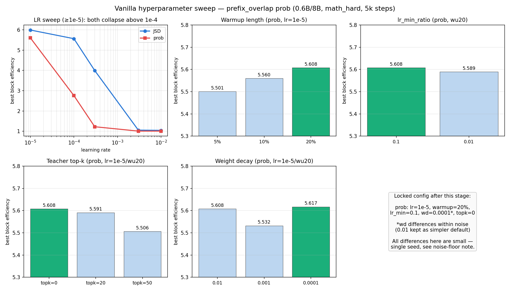
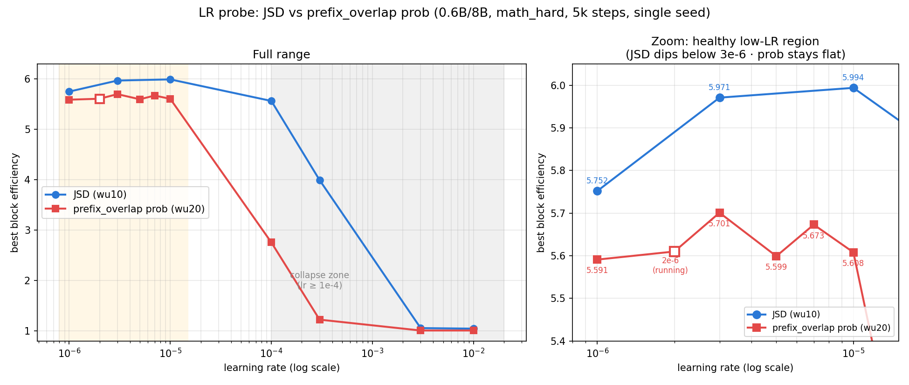
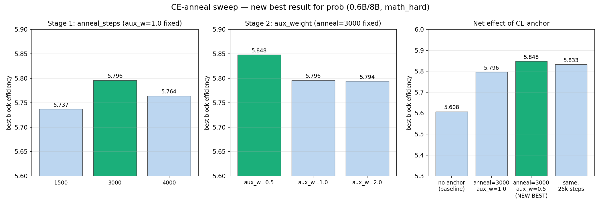

# Hyperparameter sweep — research report

0.6B/8B, math_hard, 5k steps, single seed unless noted.

## 1. Vanilla sweep (LR, warmup, lr_min, top-k, weight decay)

Both `jsd` and `prefix_overlap prob` collapse hard above `lr=1e-4`; jsd's cliff
is later/gentler than prob's. Within the healthy range, warmup=20% edges out
5%/10%; `lr_min`, `top-k`, and `weight_decay` all move the needle by <0.1 BE —
inside single-seed noise, not a real effect. **Locked config: `lr=1e-5,
warmup=20%, lr_min=0.1, wd=0.01, topk=0`.**

## 2. LR boundary probe (below 1e-5)

`prob@3e-6` beats the `1e-5` baseline (5.701 vs 5.608) — the vanilla sweep's
"locked" LR wasn't actually optimal. jsd instead shows a peaked plateau
(3e-6–1e-5, ~5.97–5.99) that dips going lower. **Still pending:** `prob@{1e-6,
2e-6,5e-6,7e-6}` and `jsd@{3e-6,1e-6}` — expect by tomorrow.

## 3. CE-anneal sweep — new overall best for `prob`

Stage 1 locks `anneal_steps=3000`; Stage 2 finds `aux_weight=0.5` beats the
original (`5.848` vs `5.796`) and even the 25k-step extension (`5.833`).
**New best `prob` config: `anneal_steps=3000, aux_weight=0.5` → best_be=5.848.**

## 4. Pass@k — full data + charts

Raw CSVs + charts: [Results/passK](https://github.com/Rmuk655/Distill-Spec-Research/tree/Pipeline/Results/passK)

Computation confirmed correct (monotonic in k everywhere, model-size control).
One real finding: 2 of 5 checkpoints trail the *untrained* draft at high k
despite beating it at k=1 — training narrows response diversity even as it
raises single-shot accuracy (see [passk_diversity_collapse_research_note.md](passk_diversity_collapse_research_note.md)).

## Caveat

Single seed throughout — gaps under ~0.1 BE (most of §1, jsd's 1e-5 vs 3e-6 in
§2) are within likely noise, not resolved without repeat seeds.
