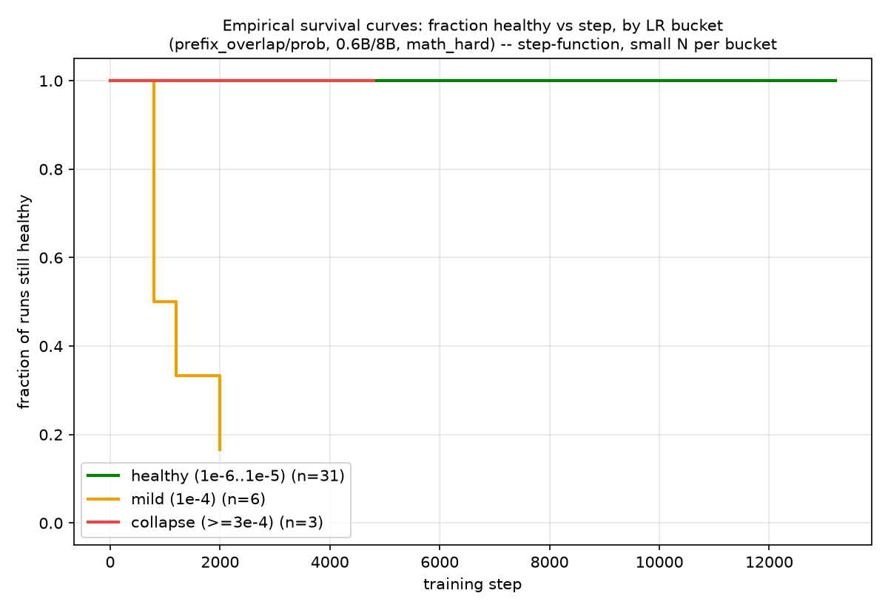
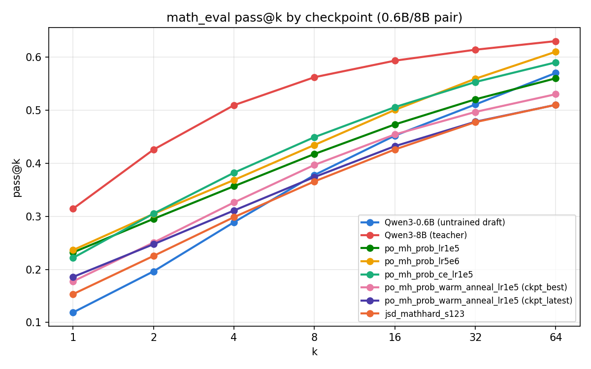
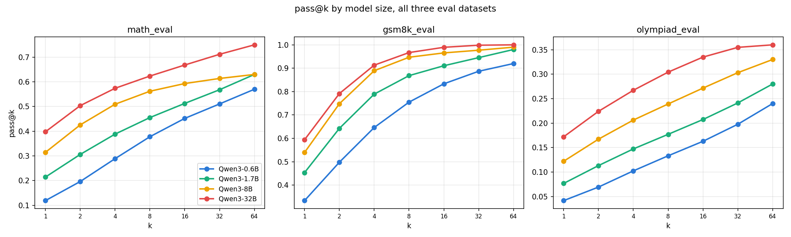
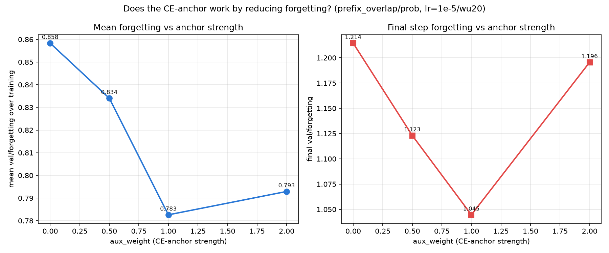
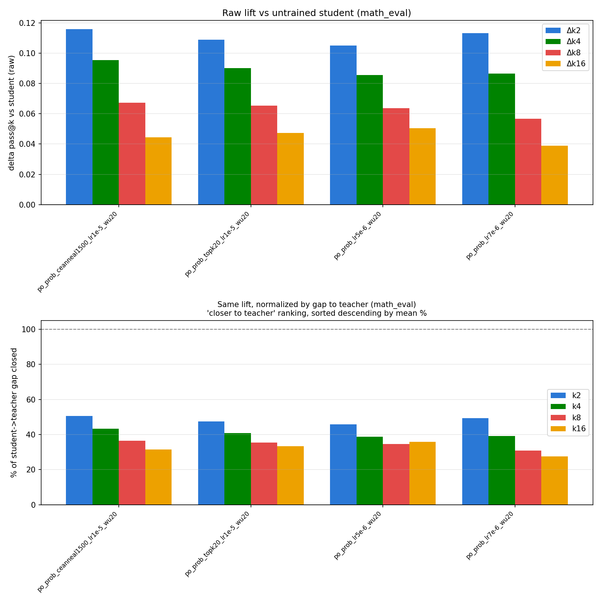
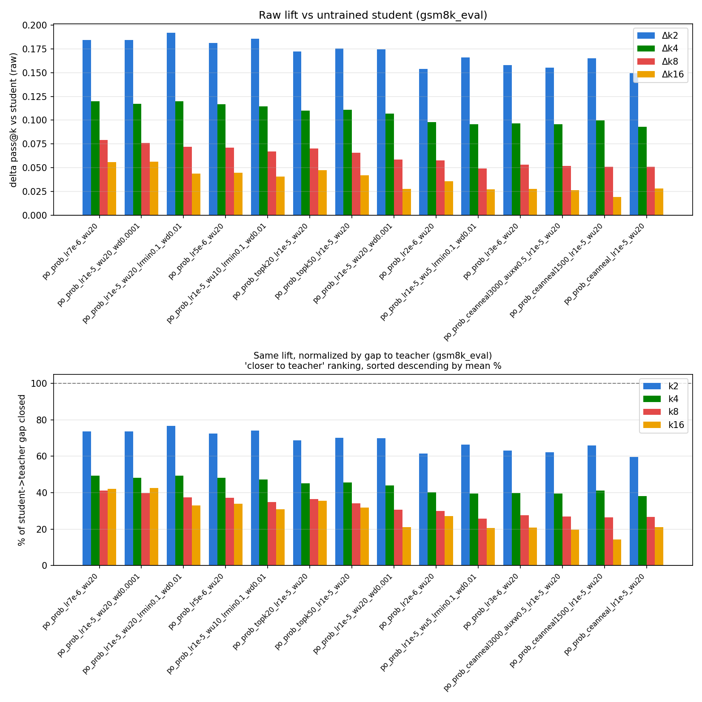
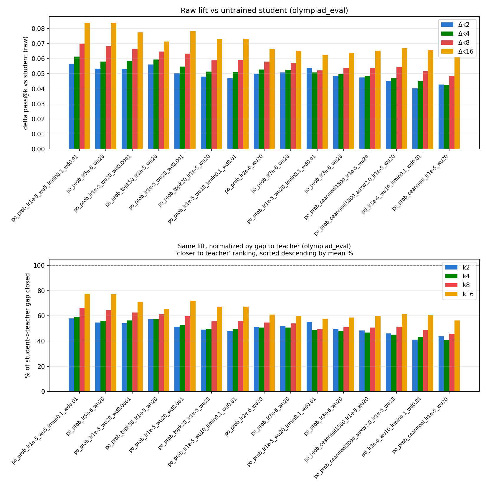
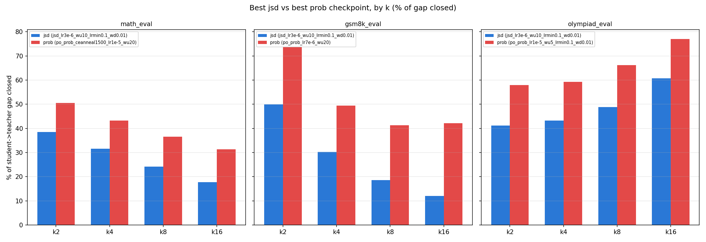
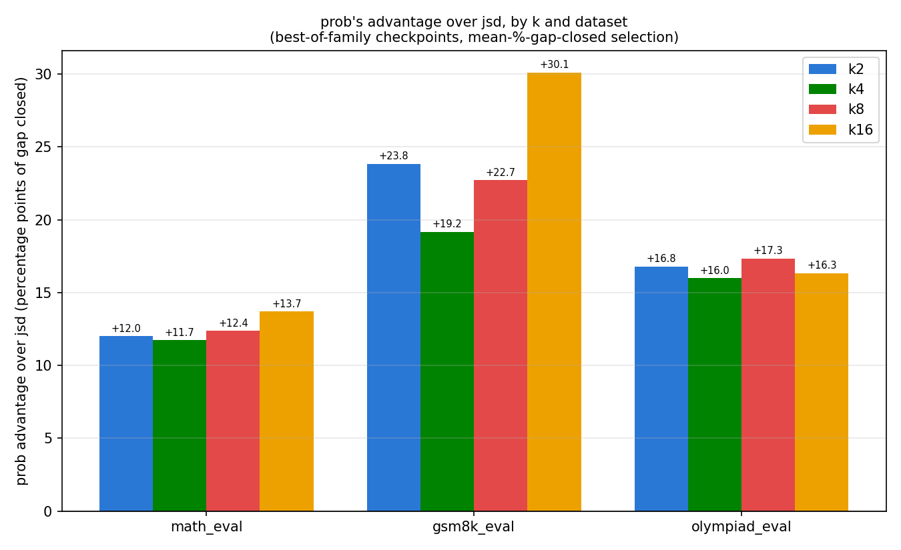

# Hyperparameter sweep — research report

0.6B/8B, math_hard, 5k steps, single seed unless noted. Raw CSVs + all charts: [results/passK](https://github.com/Rmuk655/Distill-Spec-Research/tree/Pipeline/results/passK)

- **LR boundary probe (below 1e-5):** `prob` peaks at `2e-6` (5.710), edging out `3e-6` (5.701) by less than that neighborhood's own noise floor (~0.20) — effectively a tie, both well clear of `1e-5` (5.608). The vanilla sweep's "locked" LR wasn't optimal either way. `jsd` holds a flat plateau `3e-6`–`1e-5` (~5.97–5.99), dips below.

- **Collapse timing by LR bucket:** healthy range (1e-6–1e-5) never collapses; `1e-4` collapses gradually/staggered by step ~2000; `≥3e-4` collapses almost instantly.

- **Pass@k:** computation confirmed correct (monotonic in k everywhere); one 2-of-5-checkpoint example trails the untrained draft at high k despite beating it at k=1 — checkpoint-specific, not general (see [passk_prob_vs_jsd_research_note.md](passk_prob_vs_jsd_research_note.md) for the full pass@k analysis, including BE-vs-pass@k divergence and the prob-vs-jsd comparison).

- **LR (jsd + prob):** both collapse hard above `lr=1e-4`; jsd's cliff is later/gentler than prob's.
- **Warmup {5,10,20%}:** 20% edges out 5%/10% (5.608 > 5.560 > 5.501) — within single-seed noise.
- **lr_min {0.1,0.01}:** no effect (5.608 vs 5.589).
- **Top-k {0,20,50}:** no benefit; mild harm at higher k (5.608 > 5.591 > 5.506).
- **Weight decay {0.01,0.001,0.0001}:** no clear trend, all within noise (5.617/5.608/5.532).
- **Grad clip {10,100,1000} vs default (1.0):** `prob`, lr=1e-5, single seed each. The real lever is the effective per-step update magnitude the threshold *allows*, not the clip frequency: raw grad norms are ~50–100 (spiking to 200–700), the same across all four runs, so a threshold of 1.0 or 10 clips ~100% of steps but rescales to a step 10× larger at 10, 100 clips ~half the steps, and 1000 essentially never clips (full raw norm passes through). best_val_block_eff rises roughly with allowed magnitude — 5.517 (1.0) → 5.647 (10) → 5.692 (1000) — with 100 (5.535) the odd point out, so the trend is directional, not clean. 1000 vs default is the largest gap (Δ=0.175), just above the ~0.13–0.15 noise floor and the only comparison in this group that plausibly clears it, still single-seed.

| grad_clip | best_val_block_eff | clip% at convergence | end-of-run (~step 4800) | run |
|---|---|---|---|---|
| 1.0 (default) | 5.517 | ~100% | — | [link](https://wandb.ai/rmukund16-indian-institute-of-technology-hyderabad/distillspec-pipeline/runs/pe2pb5la) |
| 10 | 5.647 | ~100% | ~5.40 | [link](https://wandb.ai/rmukund16-indian-institute-of-technology-hyderabad/distillspec-pipeline/runs/9w41gr72) |
| 100 | 5.535 | ~48% | ~5.40 | [link](https://wandb.ai/rmukund16-indian-institute-of-technology-hyderabad/distillspec-pipeline/runs/xr0bchto) |
| 1000 | 5.692 | ~0% | ~5.48 | [link](https://wandb.ai/rmukund16-indian-institute-of-technology-hyderabad/distillspec-pipeline/runs/1obcwkp6) |

  All four grad_clip variants show the same early-peak-then-decline shape in `smoothed_block_eff`: e.g. 1000 peaks ~5.68–5.69 then falls to ~5.48 by step 4800, 100 peaks ~5.52 then falls to ~5.40. The higher peak at 1000 does NOT persist — by end-of-run all thresholds converge to ~5.40–5.48, within noise of each other; 1000's decline lands marginally above 10/100's, not worse. Since `ckpt_best` deploys the peak (not the final step), the peak is the number that counts, which is why the table's best_val_block_eff differs from the raw chart's right edge. In every case `val/forgetting` climbs in lockstep (0 → ~1.0–1.2) as block_eff falls — the forgetting metric doing its job, not a gradient-sign bug (`train/loss` decreases monotonically throughout). Grad_clip does not prevent this decline at any threshold tested. None of the four points close the gap to jsd's real best-BE deployment pick (5.994, see the jsd-vs-prob fair comparison below) — grad_clip tuning moves prob's BE by ~0.1–0.2 at most, not enough to touch that ~0.3–0.5 gap.
- **Teacher temp {0.5,0.7} vs default (1.0):** `prob`, lr=1e-5, single seed each — 0.7 edges out 0.5 and the default (5.643 > 5.602 > 5.517). Spread is 0.126 BE, the same order as other single-axis probes at this exact lr=1e-5 point (grad_clip's spread was 0.130, lr_min's 0.072) — within noise, no confirmed effect. [0.5](https://wandb.ai/rmukund16-indian-institute-of-technology-hyderabad/distillspec-pipeline/runs/dufzb7pw) · [0.7](https://wandb.ai/rmukund16-indian-institute-of-technology-hyderabad/distillspec-pipeline/runs/tybxo9l6) · [1.0 default](https://wandb.ai/rmukund16-indian-institute-of-technology-hyderabad/distillspec-pipeline/runs/pe2pb5la).
- **Multi-root, tail-reuse estimator — N {16,32} and random-offset, `prob` lr=1e-5:** N=16 vs N=32 (both fixed-offset): 5.699 vs 5.647, Δ=0.052 — within noise, no N effect. Offset on vs off at N=16: 5.744 vs 5.699, Δ=0.045 — within noise, no offset effect. All three beat the single-root baseline (5.608) by 0.039–0.136, with N=16+random-offset (5.744, Δ=0.136) sitting right at the edge of the noise floor, not a verified win.
- **Doc-faithful fresh multi-root estimator vs tail-reuse — N=16, M=1, `prob` lr=1e-5 (CLOSED):** `po_prob_multiroot_N16_freshM1_lr1e-5_wu20` finished at best_val_block_eff=5.653 (best_smoothed=5.561), reached at step 4000/5000 — notably late relative to every other `prob` config tested (all of which peaked well before step 2400) and held close to that peak through the final val (5.609 at step 4800, only 0.044 below best, not a sharp collapse). Despite the different-shaped trajectory, the final magnitude (5.653) sits *below* tail-reuse N16's own 5.699, Δ=-0.046 — within noise. The fresh, independent-per-root estimator (which removes tail-reuse's cross-root correlation, matching the doc §5 spec literally) shows no detectable improvement or regression over the cheaper tail-reuse approximation here. Combined with the N/offset results above, every axis tested on the multi-root estimator (N, offset, fresh-vs-tail-reuse) has come back within noise — this sub-experiment is closed as inconclusive, not pursued further (a proposed grad_clip=1000 + extended-steps follow-up was considered and dropped given this result).
- **Single-root M {4,8,16}, `prob` lr=3e-6, all cold-start from `Qwen/Qwen3-0.6B` (CLOSED):** best_val_block_eff — M4=5.701, M8=5.810, M16=5.619 (first run) / **5.694 (clean cold-start replication `po_prob_M16_lr3e-6_wu20_cold`, done, 5000 steps)**. The replication does NOT reproduce the earlier M16 decline: 5.694 sits between M4 and M8, tied with M4 (Δ=0.007) and only 0.116 below M8. The two M16 seeds span 5.619–5.694 (spread 0.075, within noise); the whole M4/M8/M16 range (≈5.66–5.81) fits inside the 0.10–0.15 floor. **Retraction:** the earlier "M16 genuinely worse, exceeds the floor" claim was a single-seed low draw and did not replicate — no confirmed M effect, and M8's numerical lead is at the edge of the noise floor, not a verified win. Experiment closed.

- **CE-anneal `anneal_steps` {1500,3000,4000}:** 3000 wins (5.796), 4000 close (5.764), 1500 lowest (5.737).
- **CE-anneal `aux_weight` {0.5,1.0,2.0}:** 0.5 is the new overall best for `prob` (5.848), beating 1.0/2.0 (~5.79 both) and the 25k-step extension (5.833).

- **Forgetting vs `aux_weight`:** anchor reduces forgetting up to `aux_weight=1.0`, then rises again at `2.0` — doesn't track the BE-optimal `0.5`, so the anchor isn't working *purely* through reduced forgetting.

- **Who lifts pass@k closest to teacher, best-of-sweep (% of student→teacher gap closed, mean over k2/k4/k8/k16):** best is dataset-dependent — `po_prob_lr7e-6_wu20` on gsm8k (51.7%), `po_prob_lr1e-5_wu5_lrmin0.1_wd0.01` on olympiad (65.1%), `po_prob_ceanneal1500_lr1e-5_wu20` on math_eval (40.4%, much lower ceiling). **Caveat: this is the best of ~14-20 variants per family, picked after seeing pass@k — a hindsight/multiple-comparisons selection, not a config you'd choose in advance.**
- **jsd vs prob, fair comparison (the ONE config per family you'd actually deploy, chosen by block_eff *before* looking at pass@k):** `po_prob_ceanneal3000_auxw0.5_lr1e-5_wu20` (prob's real best-BE pick, 5.848) vs `jsd_lr1e-5_wu10_lrmin0.1_wd0.01` (jsd's real best-BE pick, 5.994) — **every difference at every k, every dataset is within the noise floor.** The "prob beats jsd" story above only shows up when cherry-picking prob's best-of-many against jsd's best-of-few; at the actual deployment configs, loss choice makes no verified practical dent in pass@k here, despite jsd's clearly better block_eff. BE and pass@k are different axes, but this data does NOT support "prob wins on pass@k" as a real effect.

- **Same check with a plain LR-only prob pick (no CE-anchor at all, `lr=2e-6`/`3e-6`, prob's actual best-BE points) vs jsd's best-BE pick:** still 0 of 12 (3 datasets × k2/4/8/16) comparisons clear the noise floor individually. But prob's raw pass@k is numerically higher in all 12/12 — a fully consistent one-sided direction that would be a coincidence under a true null. Suggestive of a small real effect this single-seed data can't confirm point-by-point, not proof of one. At matched LR (`prob lr=1e-5` vs `jsd lr=1e-5`), one comparison (gsm8k k16) does clear the floor (+0.0385 vs floor 0.0313) — the one individually-significant hit found across all these checks.

## Caveat

Single seed throughout — gaps under ~0.1 BE are within likely noise, not resolved without repeat seeds. Noise floor itself is non-uniform by LR (e.g. ~0.004 near `3e-6` vs ~0.20 near `2e-6`) — check any claimed gap against the local noise level, not a single sweep-wide number.
