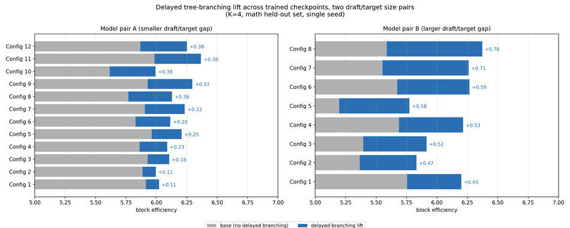
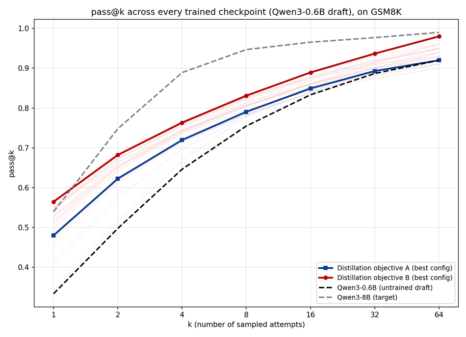

# Engineering an LLM inference research platform for speculative decoding

During my second-year summer, I worked on LLM inference optimization through speculative decoding, under the guidance of Rahul [@Rahul], an ML researcher at Columbia University. Rahul developed the verifier implementations and supervised the project; I built the training infrastructure, experiment platform, and evaluation pipeline, implemented new distillation objectives, and ran the experimental analysis.

Over six weeks I:

- Ran 500+ tracked experiments (about 250 training runs), logged in Weights & Biases
- Evaluated 71 trained checkpoints across 4,000+ measurements
- Built and operated a multi-GPU speculative-decoding research platform, training, evaluation, and analysis, in PyTorch, HuggingFace, and vLLM, growing to roughly 10,000 lines of code
- Implemented and trained against dozens of distillation objectives, some from published work and some designed from scratch, to beat a strong, well-proven baseline; most struggled, a few succeeded, and I validated why the rest fell short
- Developed a multi-sample distillation approach that beat the standard flat-divergence baseline (JSD)
- Extended a verification-time decoding technique to trained draft models, a case the original paper never evaluated

## The problem

LLMs decode one token at a time, and each token costs a full forward pass. Speculative decoding adds a small, fast draft model that proposes several tokens ahead; a large target model verifies them in one parallel pass and accepts the longest matching prefix. The core metric is block efficiency: accepted tokens per target call. Since the target dominates inference cost, block efficiency is a direct, hardware-agnostic multiplier on decode throughput — the number worth optimizing, not raw tokens/sec from any one harness.

Raising it means raising the draft's acceptance rate, and the standard lever is knowledge distillation ([DistillSpec](https://arxiv.org/abs/2310.08461)): training the draft to match the target's output distribution. The central question: which distillation objective actually moves block efficiency, tested on a student-teacher pair (Qwen 0.6B/8B) and a wider one (Qwen 1.7B/32B).

*The inference mechanism, the training loop, and the evaluation infrastructure built around both.*

## Building the research infrastructure

I built the infrastructure needed to run, recover, evaluate, and analyze hundreds of training experiments in parallel across heterogeneous GPU hardware: an experiment orchestration layer with crash recovery, a harness sweeping every verifier ([Traversal Verification](https://arxiv.org/abs/2505.12398), [SpecTr](https://arxiv.org/abs/2310.15141), [SpecInfer](https://arxiv.org/abs/2305.09781), [Greedy Block Verification](https://arxiv.org/abs/2602.16961), and others, training-free tree-based algorithms for a fixed draft model) by tree-width by dataset combination, and analysis tooling pulling every run's metric history from the Weights & Biases API to rank configs, group by seed for robustness, and flag overfit, stalled, or diverged runs. A separate vLLM pipeline, with its own async backend and isolated environment, generated tens of thousands of samples for pass@k benchmarking using a paged KV-cache and continuous batching, with resumable, checkpoint-skipping logic so killed runs never lost completed work.

The 32B teacher was the harder memory constraint. At full precision it needs roughly 64GB just for weights, leaving little headroom once the student, its optimizer state, and multi-rollout activations are added — it does not fit at all on a 40GB card, and barely fits on an 80GB one. So training ran the teacher as a quantized copy, while evaluation reloaded the full-precision teacher separately — a deliberate split, so the reported numbers reflect the deployment-accurate target rather than the compressed approximation training used. Getting to that split took real trial and error: what to compress, by how much, and on which side (student or teacher) shifted as GPU availability changed over the project, and each option traded memory against training speed differently.

A typical iteration: implement a new objective in PyTorch, validate its gradients on a handful of toy steps, launch multi-GPU sweeps tracked in Weights & Biases, evaluate every checkpoint across the full verifier grid, and extend analysis scripts to check whether observed gains exceeded the estimated noise floor.

One of those rules came from a real bug: early on, the same checkpoint measured differently across parallel evals, run to run. The cause was CPU contention between eval processes corrupting the timing-sensitive part of the measurement, not just slowing it down; isolating each eval's CPU budget fixed it and became a standing rule from then on. From there, a few more things kept the loop from wasting hardware: packing multiple concurrent training runs onto one GPU when the model pair was small enough to afford it, early-stopping a sweep on a smoothed validation plateau so a dead run frees its GPU instead of idling to a fixed step count, and caching both training and evaluation progress to disk so a killed sweep only redoes the unfinished work.

One systems lesson surprised me: profiling showed GPU utilization well under 100% during generation — time was going into CPU-GPU handoff and per-step Python overhead, not the model's actual matrix multiplications. A production setup would engineer that away; I didn't, since it wasn't the point of the project. The consequence was a metric choice: tokens/sec would have measured my harness's inefficiency as much as the algorithm, so I reported block efficiency, which isolated the algorithmic improvement better than wall-clock throughput in this setup.

FlashAttention and PyTorch's native SDPA kernel compute mathematically identical attention but round differently in bf16, almost always invisibly. Here, acceptance is a hard threshold, so a last-decimal rounding difference can flip one accepted token and cascade through the rest of a generation. Two runs on two machines, identical except for attention backend, diverged by roughly 0.2 block efficiency, comparable to the effects I was measuring. The fix was pinning one backend everywhere and logging which ran, which required reasoning about kernel-level numerics, not model architecture.

## Investigating training objectives

We designed ablation studies to isolate which distillation objectives transfer to higher block efficiency versus which only look correct on paper, spanning tree-structured losses, reinforcement-learning-style rewards, curriculum weighting, and multi-rollout enrichment, some from published work and some designed from scratch.

Two objectives illustrate why this is hard. One trains the draft to match the target deep into a sequence of guesses, not just the first token. Its gradient naturally vanishes with depth, so the standard fix moves it into log-space; applying that fix made results worse, including an outright collapse at a wider capacity gap (block efficiency down 0.4-0.6 from scratch): the reformulation solves vanishing gradients but overcorrects, shifting weight toward deep, low-probability continuations the draft rarely reaches. The second targeted the exact deployment verifier directly, the most "aligned" choice on paper; it turned out to be the single worst performer of anything tested, for the same reason. The lesson: an objective aligned with the eval metric on paper is not automatically trainable, gradient allocation mattered more than how closely its form matched the final metric.

A depth-weighted curriculum and a REINFORCE-based formulation both failed to hold up, for reasons that only became clear empirically, not from a rigorous argument in advance. The curriculum multiplied the loss by a detached scalar, which rescales gradient magnitude, not direction, so it could not fix a capacity bottleneck. REINFORCE rewarded block efficiency directly, but that pulls a model toward its own high-reward trajectories rather than the target's broader distribution, and the metric declined in a clean, monotonic pattern consistent with that mechanism.

## Extending existing methods

Multi-rollout distillation, sampling several stochastic continuations from the target instead of one greedy one, was the one training-side change that beat the baseline, with a sweet spot at four rollouts. Trained only on MATH, the gain held on OlympiadBench, never seen in training.

The strongest improvement came from the verification side. [Rahul's own published research](https://arxiv.org/abs/2602.16994) introduced a technique that delays where the draft's speculation tree branches, committing to a single stem before splitting into candidates at the point where draft and target distributions actually diverge, instead of branching at the first token — but only ever evaluated on untrained draft models, never trained, distilled ones. Swept across every trained checkpoint, both model pairs, it improved block efficiency on nearly all of them, by up to roughly 0.8 additional accepted tokens per call (about 14% on the larger pair), and stacking it on the multi-rollout distillation above gave the best single result in the project.

I then derived the branch-point setting instead of grid-searching it, tracking each checkpoint's own mean acceptance depth so stronger drafts branch later.

*Delayed tree-branching, every checkpoint, both model pairs: nearly all improved, more so from weaker starting points.*

## Building better evaluation metrics

Block efficiency measures whether the draft matches the target's output distribution, not whether distillation makes it a better reasoner. To check that directly, I built a pass@k pipeline: sample k completions per problem, check whether any is correct.

This revealed effects invisible to block efficiency alone. Some checkpoints improved pass@1 while regressing at pass@64: distillation sharpened single-sample accuracy but narrowed output diversity, the opposite of what many-sample decoding needs. Others improved reasoning despite lower acceptance rates than a different checkpoint, so the two metrics respond to training differently. Training closed a real but bounded fraction of the gap to the target, roughly a third to two-thirds, never all of it.

*Training closes part of the gap to the target, never all of it.*

I added two further axes: forgetting (regression on previously-solved problems mid-training) and difficulty-bucketed accuracy. Together they surfaced runs that looked healthy in aggregate but were regressing underneath or only helping the easy bucket.

Which dataset I evaluated on mattered almost as much as which checkpoint. Across GSM8K, Hendrycks MATH, and OlympiadBench (increasing difficulty), GSM8K was close to saturated for every model and barely separated good runs from bad; the harder sets showed far more spread.

None of this is meaningful without knowing how much run-to-run noise to expect, so I estimated a per-k noise floor from near-duplicate configurations and compared it to the full spread observed across every setting swept: at most k, the floor matched the spread, meaning most differences between configurations were noise, not signal.

## Closing

The project taught me that scaling ML research depends as much on engineering as algorithms. Reliable infrastructure, reproducible evaluation, careful benchmarking, and numerical debugging were what made hundreds of experiments possible, and ultimately determined which ideas were worth pursuing.
