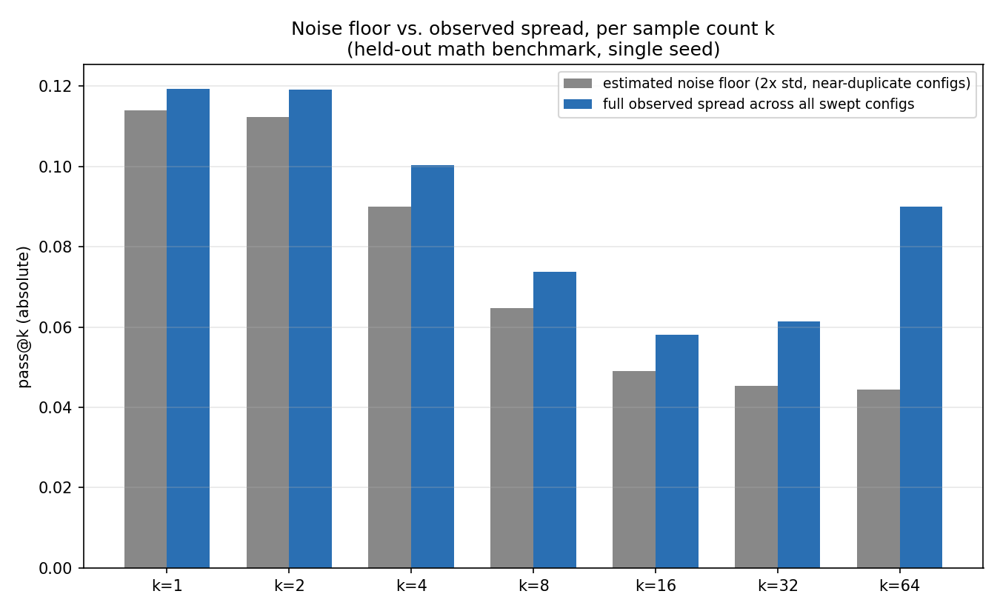

# Lessons from an LLM Inference Research Internship: Speculative Decoding, Distillation, and Evaluation

During my second-year summer, I worked on **LLM inference optimization** through **speculative decoding**, under the guidance of Rahul [@Rahul], a researcher at Columbia University.

Over eight weeks I:

- Ran **500+ tracked experiments** (~250 training runs), logged in **Weights & Biases**
- Evaluated **71 trained checkpoints** across **4,000+ measurements**
- Built a multi-GPU experiment and evaluation pipeline in **PyTorch** and **HuggingFace**, generation served with **vLLM**
- Developed and experimentally validated hypotheses for why several distillation objectives — some adapted from published work, others novel constructions we designed — underperformed in this setting
- Developed a multi-sample distillation approach that beat the standard **JSD** baseline
- Extended a verification-time speculative decoding technique to **trained** draft models — the original paper only evaluated it on untrained ones

The project combined research, systems engineering, and experimental design: reproducing published methods, building scalable infrastructure, and evaluating why objectives succeeded or failed.

## The problem

LLMs decode one token at a time, and each token costs a full forward pass. Speculative decoding adds a small, fast **draft model** that proposes several tokens ahead; a large **target model** verifies them in one parallel pass and accepts the longest matching prefix. The core metric is **block efficiency** — accepted tokens per target call. Raising it means raising the draft's **acceptance rate**, and the standard lever is **knowledge distillation**: training the draft to match the target's output distribution. The project's central question was which distillation objective actually moves block efficiency, tested on a 0.6B/8B draft-target pair and a wider 1.7B/32B pair.

The codebase grew to roughly 10,000 lines of PyTorch training, evaluation, and experiment-management code, spanning automated checkpointing, multi-GPU experiment orchestration, and analysis tooling — not counting a separately vendored verifier library used as-is.

*Three layers: the inference-time mechanism being optimized, the training loop that shapes the draft model, and the evaluation infrastructure that measured whether it worked.*

## Building the research infrastructure

I built a multi-GPU experiment pipeline supporting parallel training, checkpoint recovery after crashes, automated evaluation across every verifier × tree-width × dataset combination, and cross-checkpoint analysis at scale — starting on a memory-constrained Colab T4 (requiring 4-bit quantization to fit the 8B target), then Kaggle's dual-T4 setup, then A100s for production runs. A separate **vLLM**-based evaluation pipeline generated tens of thousands of samples for **pass@k** benchmarking, using paged KV-cache and continuous batching to keep it fast enough to be usable, with resumable, checkpoint-skipping logic so a killed run never lost completed work.

A typical experiment cycle looked like: implement a new loss variant in PyTorch, validate its gradient behavior against a known baseline on a handful of steps, launch a multi-GPU sweep tracked in Weights & Biases, evaluate every resulting checkpoint across the full verifier grid, then write or extend an analysis script to compare acceptance metrics and pass@k against prior runs.

One infrastructure bug is worth calling out on its own: **FlashAttention** and PyTorch's native **SDPA** kernel compute mathematically identical attention but round differently in **bf16**. Almost everywhere that's invisible. Here, acceptance is a hard threshold, so a last-decimal rounding difference can flip one accepted token and cascade through the rest of a generation. Two runs on two machines, identical except for attention backend, diverged by roughly 0.2 block efficiency — comparable to the effects I was trying to measure. The fix was to pin one backend everywhere and log which ran, but finding it required reasoning about kernel-level numerics, not model architecture.

All 500+ runs were tracked in **Weights & Biases** across two projects, with custom analysis tooling to surface hyperparameter effects and flag single-seed noise before it got mistaken for a real result.

## Investigating training objectives

I designed **ablation studies** to isolate which distillation objectives transfer to higher block efficiency, and which only look correct on paper.

An on-policy objective optimized a **telescoping product of per-step acceptance probabilities** — training the draft to match the target deep into a sequence of guesses, not just the first token. Although a **log-space** reformulation prevented the gradient from vanishing at depth, it shifted the objective's weighting toward deep, low-probability continuations the draft rarely reached in practice — leading to consistently worse training dynamics, and outright collapse in a from-scratch, wider-capacity-gap setting where block efficiency dropped by 0.4–0.6. A second objective, built to target the exact deployment verifier directly — the most "aligned" choice on paper — was the single worst-performing variant tested, for a similar reason: matching the target's exact acceptance criterion turned out to weight the objective toward positions the draft could not yet reach. These results suggested that an objective aligned with the eval metric on paper isn't automatically trainable — gradient allocation across the sequence mattered more than how closely the objective's form matched the final metric.

Two further hypotheses looked unlikely to work before I ran them, and I ran a number of variants of each anyway to confirm it. A depth-weighted curriculum used a **detached scalar** multiplying the loss — which rescales gradient magnitude, not direction, so it couldn't address a capacity bottleneck no matter how it was tuned, and several weighting schemes across two model pairs bore that out. A **REINFORCE**-based formulation rewarded block efficiency directly; in this setting, the policy-gradient objective encouraged the draft to concentrate around its own high-reward trajectories rather than matching the target's broader output distribution, and the metric declined in a clean, monotonic pattern consistent with that mechanism.

## Extending existing methods

The one training-side change that beat the baseline: distilling on **multiple stochastic rollouts** sampled from the target, instead of a single greedy continuation. Broader coverage of the target's actual output distribution outperformed standard JSD distillation, with a sweet spot at four rollouts, and the gain held on an out-of-distribution eval set.

The stronger result came from the verification side. A recent technique delays where the draft's speculation tree branches — committing to a single stem before splitting into candidates, instead of branching at the first token — targeting branch points where draft and target distributions actually diverge. The original paper evaluated this only on **untrained** draft models. I built it out and swept it across every trained checkpoint in the project, on both the 0.6B/8B and 1.7B/32B pairs: it improved block efficiency on nearly all of them, with gains increasing at greater speculation depth and larger on weaker starting checkpoints. To the best of my knowledge, I couldn't find a prior evaluation of this technique on trained, distilled drafts — and stacking it on top of the multi-rollout distillation above produced the best single block-efficiency result in the project.

I then went further and derived the branch-point setting instead of grid-searching it: it tracks each checkpoint's own mean acceptance depth, so a stronger draft branches later on its own. The value comes from the model's measured behavior, not a search.

*Delayed tree-branching applied to every checkpoint I trained, across two draft/target size pairs — nearly every checkpoint improved, with larger gains on weaker starting points.*

## Building better evaluation metrics

Block efficiency measures whether the draft's output distribution matches the target's, not whether distillation makes the draft a better reasoner. To check that directly, I designed and built a **pass@k** evaluation pipeline: sample k completions per problem, check whether any is correct.

Across checkpoints, this revealed effects invisible to block efficiency alone: some checkpoints improved pass@1 while regressing at pass@64, consistent with distillation reducing output diversity even as it sharpened single-sample accuracy. Others improved reasoning despite *lower* acceptance rates than a different checkpoint — suggesting inference efficiency and reasoning quality respond to training in different ways. Training closed a real but bounded fraction of the gap between the untrained draft and the target — roughly a third to two-thirds, varying by dataset and by k, never the whole gap.

*Training closes part of the gap to the target model — never all of it — and by how much depends heavily on k.*

I added two further axes — **forgetting** (regression on previously-solved problems mid-training, a backward-transfer check) and **difficulty-bucketed accuracy** (easy/medium/hard, split by baseline performance) — which surfaced runs that looked healthy in aggregate but were regressing on problems they'd already solved, or only helping on the easy bucket.

None of this is meaningful without knowing how much run-to-run noise to expect. I estimated a per-k noise floor from near-duplicate configurations and compared it against the full spread observed across every setting swept:

*At most k, the floor and the full sweep's spread are nearly identical — most apparent differences between configurations are noise, not signal. k=64 is the exception, where the spread clearly exceeds the floor.*

## Closing

The project reinforced something I'll carry into future ML research: reliable systems come from understanding optimization dynamics, evaluation design, and infrastructure together, not any one in isolation. The most valuable output wasn't a single experiment that won — it was building the discipline to test hypotheses rigorously, infrastructure reliable enough to trust the results it produced, and evaluation broad enough to catch what a single metric would have missed.
