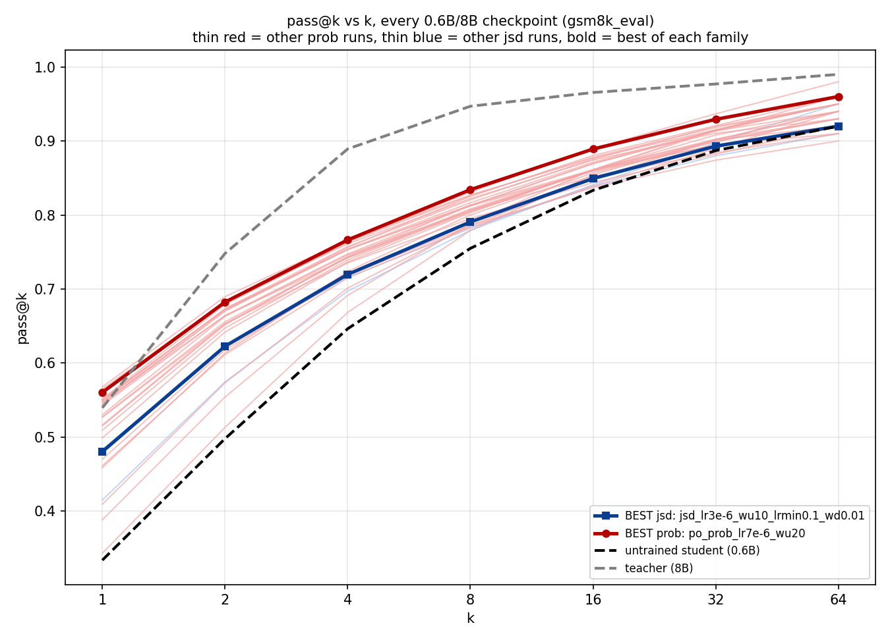

# Pass@k: trained drafts vs teacher, and prob vs jsd (real ckpt_best eval)

## Formula

`pass@k = 1 - C(n-c, k) / C(n, k)` (Chen et al. 2021), `n=64` samples/prompt,
`c` correct among them, averaged over 100 held-out prompts. At `k=n=64` this
is just "did ≥1 of 64 tries succeed" per prompt.

All findings below use real `ckpt_best` offline eval, not wandb
approximations — 27 checkpoints, `results/passK/passk_hparam_sweep.csv`.
Noise floor = 2×std(pass@k) across the flat low-LR `prob` cluster, per k per
dataset (same method as `scripts/analyze_passk_movement.py`) — a delta only
counts as real if it clears this.

## Findings

- **No general collapse. Trained drafts mostly sit between the untrained
  student and the teacher on pass@k**, as expected for a partially-working
  distillation. Cases where a trained checkpoint's pass@64 dips below the
  untrained baseline exist but are checkpoint/dataset-specific on a
  100-prompt held-out set — anomalies, not a general training effect. See
  footnote for one concrete example.

- **BE and pass@k do not move together.** jsd has the strongest deployed
  `best_val_block_eff` (5.994) of anything tested. Checked against jsd on
  pass@k, per dataset:
  - `math_eval`: **0/27** configs clear the floor at any k — **no winner**,
    everything within noise.
  - `olympiad_eval`: **2/27** clear, marginally — **no major winner**.
  - `gsm8k_eval`: **~15/27** clear the floor, concentrated at k16/k32/k64
    — **the one dataset where several `prob` configs genuinely beat jsd on
    pass@k**, each at a real BE cost (their `best_val_block_eff` sits
    0.18–0.46 below jsd's 5.994).

  

  Best-of-family by pass@k gap-closed (a different, hindsight selection
  criterion than the BE-deployed-pick comparison above — see chart):
  `po_prob_lr7e-6_wu20` sits clearly above jsd's own best-pass@k pick
  (`jsd_lr3e-6_wu10_lrmin0.1_wd0.01`) across nearly the entire curve, both
  above the untrained student and below the teacher — the clearest visual
  confirmation of the floor-gated result above.

- **Multi-root (N=16, N=16+random-offset, N=32) consistently beats jsd on
  `gsm8k` k32/k64** — all three tested clear the floor at both k32 and k64
  (deltas 0.022–0.04 vs floor 0.021–0.028). Plain N=16 (no offset) has the
  broadest effect, also clearing k16 (Δ=0.031). **Winner: yes, consistent
  across the whole N-family tested.**

- **Grad_clip does NOT show a consistent pass@k effect** — `gradclip100`
  clears `gsm8k` k16/k32/k64 (Δ 0.033–0.04); `gradclip1000` clears nothing
  anywhere. **No consistent winner across the family** — don't generalize
  from the `gradclip100` result alone.

- **Prefix_M family: not yet assessable.** Only `M16_lr3e-6_wu20_cold` is in
  the current offline-eval set; `M4`/`M8` haven't gone through `passk_eval.py`
  yet (pending the `/sensei-fs-3` batch). Revisit once that data lands.

## Footnote — one checkpoint-specific example (not a general finding)

[passk_by_checkpoint_math_eval_06b_8b.png](../results/passK/passk_by_checkpoint_math_eval_06b_8b.png):
`warm_anneal_lr1e5` and `jsd_mathhard_s123` beat the untrained `Qwen3-0.6B`
at `k=1` (0.178/0.153 vs 0.119) but the untrained curve is steeper and
crosses back above both by `k≈16-32`, finishing higher at `k=64`
(0.570 vs 0.530/0.510). `lr5e6` and `ce_lr1e5` stay above baseline the whole
curve on the same dataset — this crossover is checkpoint-specific, not a
property of training in general. [passk_by_model_size_all_datasets.png](../results/passK/passk_by_model_size_all_datasets.png)
is the control: across model *size* (no training), every curve is strictly
monotonic at every k — confirms the pass@k math itself is correct.

## Dataset headroom (k=64, untrained 0.6B → teacher 8B)

| dataset | k=64, 0.6B→8B | note |
|---|---|---|
| `olympiad_eval` | 0.240 → 0.330 | lowest absolute scores everywhere (32B teacher itself only hits 0.36) |
| `math_eval` | 0.570 → 0.630 | mid-range, not saturated — but 0/27 configs clear a real floor here regardless |
| `gsm8k_eval` | 0.920 → 0.990 | near-ceiling by absolute level, yet the most floor-clearing-sensitive dataset found |

## Practical read

- Judge a checkpoint by pass@k gap-closed to the teacher, per dataset —
  not by pass@1 or by block_eff alone; the two axes diverge (BE-vs-pass@k
  bullet above).
- `math_eval` and `olympiad_eval` pass@k differences are not currently
  usable as a go/no-go signal — nothing clears a real floor there.
- `gsm8k_eval` at k16/k32/k64, floor-gated, is currently the most useful
  lens for a real prob-vs-jsd gap.
- Re-derive the floor whenever the checkpoint set changes; it moves as new
  runs join the reference cluster.
