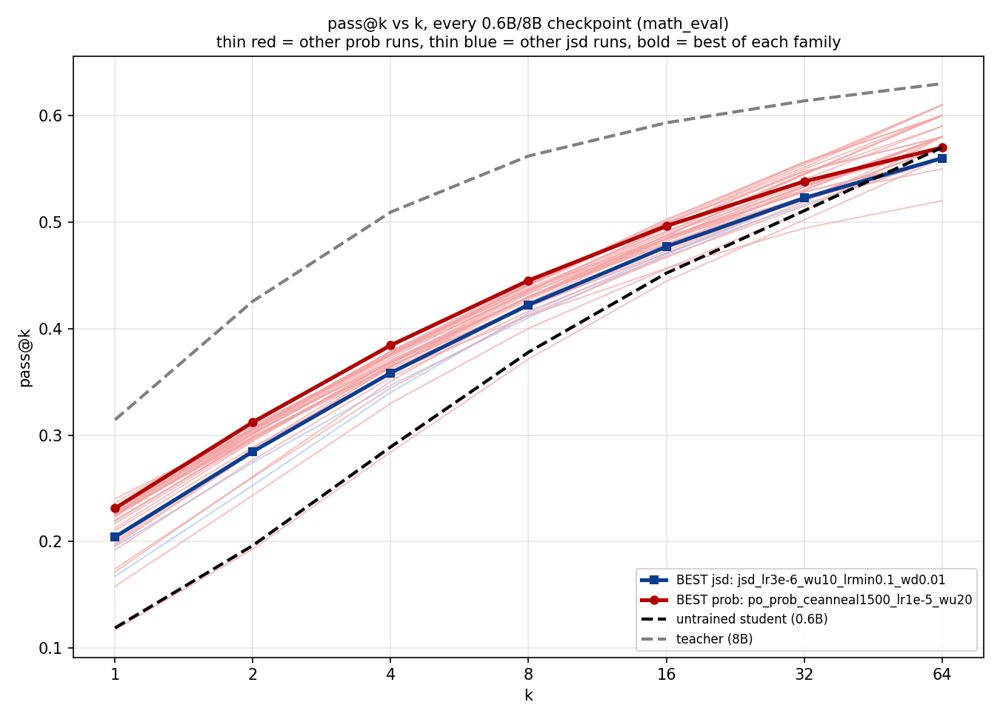
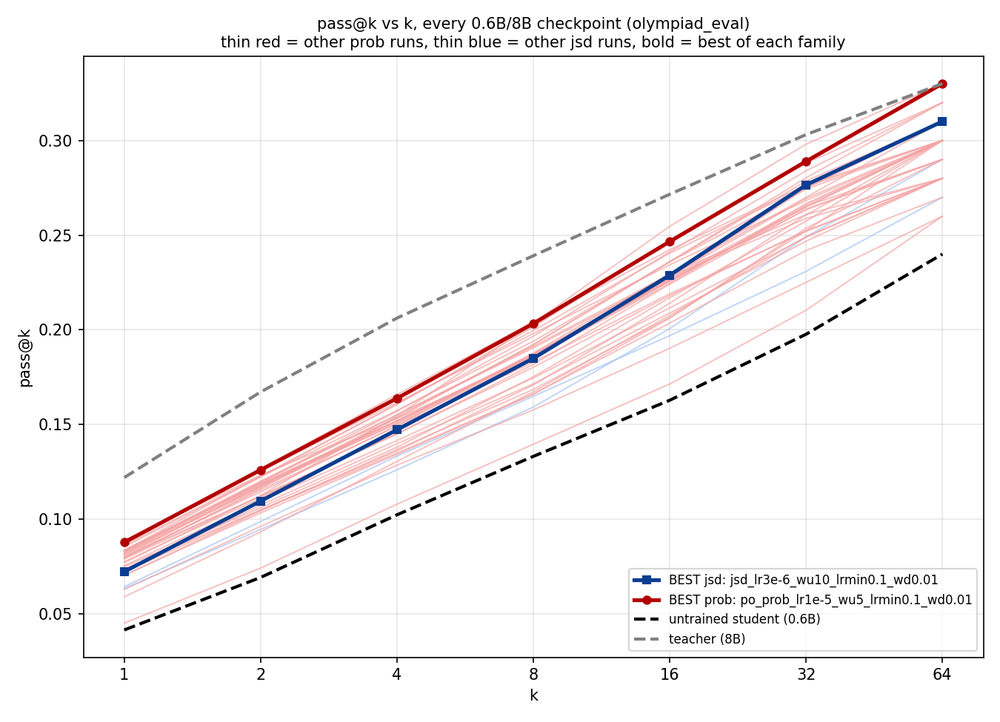

# Pass@k: trained drafts vs teacher, and prob vs jsd (real ckpt_best eval)

## Formula

`pass@k = 1 - C(n-c, k) / C(n, k)` (Chen et al. 2021), `n=64` samples/prompt,
`c` correct among them, averaged over 100 held-out prompts. At `k=n=64` this
is just "did ≥1 of 64 tries succeed" per prompt.

36 checkpoints, real `ckpt_best` offline eval:
[results/passK/passk_hparam_sweep.csv](../results/passK/passk_hparam_sweep.csv).
Noise floor = 2×std(pass@k) across the flat low-LR `prob` cluster, per k per
dataset — a delta only counts as real if it clears this.

**What "clears the floor" means:** most `prob` configs sit numerically
*above* jsd's curve on every dataset, including `math_eval` — the direction
is consistently prob-favoring. "Clears the floor" means that gap is bigger
than the run-to-run spread already measured across a set of nominally
similar low-LR configs (2×std of that spread). Where a gap does *not*
clear it, prob is still numerically ahead, just by less than what a single
seed's own noise could produce on its own — so it isn't confirmed as a
real effect, not "prob is worse."

**What `best_val_block_eff` is, and isn't:** it's a training-time metric
only — computed once per checkpoint during training, on `math_val`, via
the block-efficiency verifier. It was never computed on `math_eval`,
`gsm8k_eval`, or `olympiad_eval` — those three are held-out pass@k sets
only, with no verifier/block_eff run on them at all. Every "BE" number
below is that single training-time value; comparing it against a
checkpoint's pass@k on any of the three held-out sets is comparing two
measurements from two different data sources, not "BE on that dataset."

## Findings

- Cases where a trained checkpoint's pass@64 dips below the untrained
  baseline are explained in the footnote.

- Checked against jsd on pass@k, per dataset. Two different questions,
  not the same thing: **direction** (of 36 checkpoints, how many sit
  numerically above jsd at this k) vs **floor-clearing** (whether that gap
  is big enough to call a real effect, not just noise). Direction turns
  out to be overwhelmingly prob-favoring on *every* dataset — the
  difference between datasets is entirely in whether that direction
  survives a floor.

  - `math_eval`: **28–34 of 36** sit above jsd at k1–k32 (drops to 21/31 at
    k64). Despite that consistent direction, **nothing clears a real
    floor** at any k — the per-config gaps are individually too small.

    

    Best-prob (`ceanneal1500_lr1e-5_wu20`) tracks just above best-jsd
    (`jsd_lr3e-6_wu10_lrmin0.1_wd0.01`) the whole curve, and most thin red
    lines sit above the thin blue lines too — but the two families'
    spreads overlap enough that no single gap clears a real floor.

  - `olympiad_eval`: **30–35 of 36** sit above jsd at k1–k32 (drops to
    21/32 at k64) — a similarly consistent direction to `math_eval` by
    per-checkpoint count. Same result as `math_eval` though: only 3/36
    gaps are large enough to individually clear the floor.

    

    The bold best-of-family lines tell a different visual story than the
    count: best-prob (`lr1e-5_wu5_lrmin0.1_wd0.01`) and best-jsd sit almost
    on top of each other through k1–32, only pulling apart at k64 (0.330
    vs 0.310) — much tighter than `math_eval`'s bold lines, which stay
    visibly separated the whole curve. The per-checkpoint count (above) is
    against the single jsd reference checkpoint across all 36 configs, not
    the gap between these two hindsight-picked bold lines — don't read the
    bold-line closeness as contradicting the count, they're answering
    different questions.

  - `gsm8k_eval`: **14–21/36** clearly win above noise, concentrated at
    k16/k32/k64 (0/36 at k1–k4) — the one held-out set with a real
    pattern.

    

    Different from the other two: best-prob (`po_prob_lr7e-6_wu20`) sits
    clearly above best-jsd across nearly the entire curve, and the
    red/blue thin-line clusters visibly separate rather than overlap.

  All three charts use best-of-family by pass@k gap-closed (a different,
  hindsight selection criterion than the BE-deployed-pick comparison
  above) — a complementary view, not a contradiction.

- **Multi-root N=16/16+offset/32 beat jsd on `gsm8k` k32/k64, but N=8 breaks
  the pattern.** N=16, N=16+random-offset, and N=32 all clear the floor at
  both k32 and k64 (deltas 0.022–0.04 vs floor 0.021–0.028), with plain
  N=16 (no offset) also clearing k16 (Δ=0.031). N=8 clears nothing
  anywhere — its closest miss is k32 (Δ=0.020 vs floor 0.021) and k64
  (Δ=0.020 vs floor 0.028). So it's not "any N ≥ some value wins" — N=8 is
  the odd one out in a family that otherwise looked consistent.

- **The doc-faithful fresh multiroot estimator (`freshM1`, N=16, M=1) does
  NOT reproduce this win — it reverses on `gsm8k`.** Tail-reuse N=16 clears
  the floor at k16/k32/k64 (Δ +0.031 to +0.034, all positive). `freshM1`
  clears nothing there, and goes *negative* at k8–k64 (Δ −0.009 to −0.040)
  — it falls below jsd, not just below tail-reuse. `math_eval` stays flat
  for both (nothing clears there for any config). `olympiad_eval` favors
  `freshM1` (clears k16/k64, one of only 3/35 configs project-wide that
  clear anywhere on this dataset, vs tail-reuse's k4/k8), but this
  dataset is where almost nothing ever clears, so that's thin evidence
  next to the `gsm8k` reversal.
  Single seed so far.

  **Update — `freshM1_ceanneal3000` (best-BE fresh-family point, 5.779)
  partially closes the reversal but doesn't clear the floor, and it's
  worse than bare `freshM1` on `olympiad_eval`.** On `gsm8k`, its gap to
  jsd is +0.007 at k8 (vs bare `freshM1`'s −0.009) and only −0.009/−0.010
  at k32/k64 (vs bare `freshM1`'s −0.028/−0.040) — the anneal substantially
  shrinks the negative dip, but every k still falls short of the floor
  (0.021–0.028), landing at "roughly tied with jsd" rather than
  "reproduces tail-reuse N16's win." On `olympiad_eval` it clears
  *nothing* (Δ +0.010–0.026, all below floor), whereas bare `freshM1`
  cleared k16/k64 there — so the anneal's `gsm8k` improvement comes with
  a small step back on the one dataset where it previously had an edge.
  Net read: anneal helps the metric that matters (`gsm8k`), but neither
  fresh-family checkpoint yet reproduces tail-reuse's confirmed win.

- **Grad_clip does NOT show a consistent pass@k effect** — `gradclip100`
  clears `gsm8k` k16/k32/k64 (Δ 0.033–0.04); `gradclip10` and `gradclip1000`
  "clear nothing" meaning their gap to jsd stays inside the noise floor at
  every k (gradclip10's closest miss is k32, Δ=0.020 vs floor 0.021), not
  that they fall below jsd. The default (`gradclip=1.0`) was never run
  through `passk_eval.py`, so it can't be included in this comparison.
  **No consistent winner across the 3 clip values tested** — don't
  generalize from the `gradclip100` result alone.

- **Prefix_M family does NOT show a consistent pass@k effect either**, now
  that `M4`/`M8`/`M16` (warm-started)/`M16_cold` are all in the
  offline-eval set. `M4` clears `gsm8k` k16/k32/k64 (Δ 0.021–0.030), `M8`
  clears the same three (Δ 0.030–0.037), `M16` warm-started also clears
  them (Δ 0.030–0.032), but `M16_cold` (same config, clean cold-start redo
  of the warm-started run) doesn't clear anywhere (Δ 0.010–0.021, inside
  the floor). No trend with `M` itself — it's the same already-known
  gsm8k pattern showing up in most (not all) `prob` checkpoints
  regardless of family.

- **Teacher temp shows the same isolated, non-lever pattern**: `ttemp=0.5`
  clears `gsm8k` k16/k32/k64 (Δ 0.027–0.033), `ttemp=0.7` stays inside the
  floor everywhere. Default is `ttemp=1.0`, not evaluated through
  `passk_eval.py` (same gap as the grad_clip default above). One point in
  a two-point family clearing isn't a confirmed temp effect, same caveat
  as `gradclip100` above.

- **CE-anneal (aux_weight=0.5) at lr=3e-6 tracks its own no-anneal base**,
  not a new effect: both clear `gsm8k` k32 (anneal Δ=0.028, base Δ=0.021),
  anneal additionally clears k16 (Δ=0.033) where the base doesn't. Anneal
  doesn't move the needle much at this LR — unlike lr=1e-5, where
  `ceanneal3000_auxw0.5` is prob's actual best-BE deployment pick.

## Footnote — why one checkpoint's trained draft is below the untrained student

[passk_by_checkpoint_math_eval_06b_8b.png](../results/passK/passk_by_checkpoint_math_eval_06b_8b.png):
`warm_anneal_lr1e5` and `jsd_mathhard_s123` beat the untrained `Qwen3-0.6B`
at `k=1` (0.178/0.153 vs 0.119) but the untrained curve is steeper and
crosses back above both by `k≈16-32`, finishing higher at `k=64`
(0.570 vs 0.530/0.510). `lr5e6` and `ce_lr1e5` — also trained, same
dataset — stay above baseline the whole curve, so training itself doesn't
cause this; it's specific to those two checkpoints.
[passk_by_model_size_all_datasets.png](../results/passK/passk_by_model_size_all_datasets.png)
is the control: across model *size* (no training), every curve is strictly
monotonic at every k — confirms the pass@k math itself is correct.

## Dataset headroom (k=64, untrained 0.6B → teacher 8B)

| dataset | k=64, 0.6B→8B | note |
|---|---|---|
| `olympiad_eval` | 0.240 → 0.330 | lowest absolute scores everywhere (32B teacher itself only hits 0.36) |
| `math_eval` | 0.570 → 0.630 | mid-range, not saturated — but nothing clearly wins above noise here regardless |
| `gsm8k_eval` | 0.920 → 0.990 | near-ceiling by absolute level, yet the dataset where a real prob-vs-jsd pattern actually shows up |

## Practical read

- Judge a checkpoint by pass@k gap-closed to the teacher, per dataset —
  not by pass@1 or by training-time block_eff alone; block_eff is measured
  on `math_val` only and is not a substitute for held-out pass@k.
- `math_eval` and `olympiad_eval` pass@k differences are not currently
  usable as a go/no-go signal — direction favors prob, but nothing clearly
  wins above noise there.
- `gsm8k_eval` at k16/k32/k64 is currently the most useful lens for a real
  prob-vs-jsd gap.
- Re-derive the floor whenever the checkpoint set changes; it moves as new
  runs join the reference cluster.
